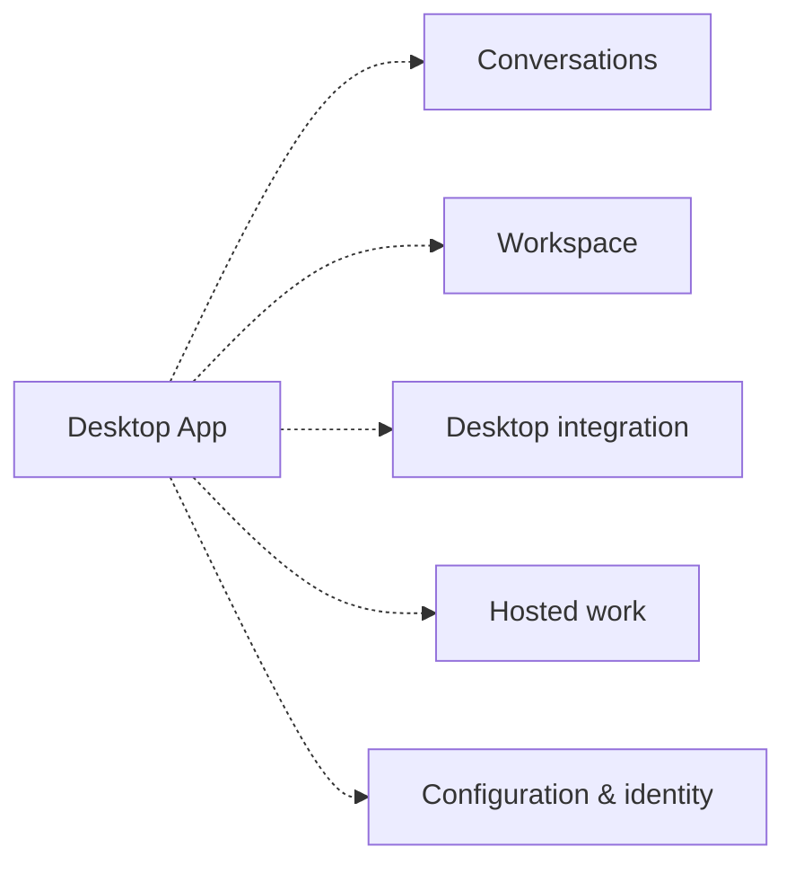

# Codex Desktop — feature graph

> Generated from the committed research model. Update with `npm run docs:build`; verify with `npm run docs:check`.

App archive: **26.903.61454**. OSS reference: [`ddea03ad049142943bdbf13e937b1d67e8c1ba0c`](https://github.com/openai/codex/tree/ddea03ad049142943bdbf13e937b1d67e8c1ba0c). The app binary's exact equivalence to that OSS revision is **unverified**.

Protocol declarations, bundle literals, static call sites, captured UI and analytical mappings are independent evidence types. A literal or call expression does not prove execution. A screenshot proves appearance, not a complete workflow. Domain associations do not automatically establish dependencies.

## Coverage

| Measure | Value |
| --- | --- |
| Package files / unpacked bytes | 8,967 / 312.30 MB |
| JavaScript files parsed | 7,262 / 7,262 |
| Import references / dynamic imports | 26,219 / 4,343 |
| Core methods / archived literal matches | 191 / 184 |
| Cloud paths / original baseline | 350 / 343 |
| Desktop IPC channels | 22 |
| Command keys / locales | 192 / 64 |
| Archived captures / matching recapture receipts | 42 / 23 |

## Bounded contexts

Contexts group related product ideas; each interface retains its own evidence and execution boundary.

### Conversations

A thread is the durable unit; turns and items describe work within it. Local and hosted conversations have different execution paths.

| Capability | Core | Cloud | IPC |
| --- | --- | --- | --- |
| [Thread lifecycle](../site/three-way.html#cap-thread-lifecycle) | 78/78 | 49 | 0 |
| [Memory and personalization](../site/three-way.html#cap-memory) | 0/0 | 14 | 0 |

Core cells show archived literal matches / protocol declarations. 94 command keys belong to this context.

| Command key | Readable label |
| --- | --- |
| `codex.aboutDialog.buildInfoLabel` | Build Info Label |
| `codex.aboutDialog.ok` | Ok |
| `codex.aboutDialog.title` | Title |
| `codex.aboutDialog.versionLine` | Version Line |
| `codex.aboutDialog.versionLineWithDate` | Version Line With Date |
| `codex.command.archiveThread` | Archive Thread |
| `codex.command.composer.startDictation` | Start Dictation |
| `codex.command.findInThread` | Find In Thread |
| `codex.command.focusBrowserAddressBar` | Focus Browser Address Bar |
| `codex.command.logOut` | Log Out |
| `codex.command.navigateBack` | Navigate Back |
| `codex.command.navigateBrowserBack` | Navigate Browser Back |
| `codex.command.navigateBrowserForward` | Navigate Browser Forward |
| `codex.command.navigateForward` | Navigate Forward |
| `codex.command.newProjectlessTask` | New Projectless Task |
| `codex.command.newThread` | New Thread |
| `codex.command.nextThread` | Next Thread |
| `codex.command.openBrowserTab` | Open Browser Tab |
| `codex.command.openFolder` | Open Folder |
| `codex.command.openPetOverlay` | Open Pet Overlay |
| `codex.command.openThreadInNewWindow` | Open Thread In New Window |
| `codex.command.previousThread` | Previous Thread |
| `codex.command.searchChats` | Search Chats |
| `codex.command.settings` | Settings |
| `codex.command.showKeyboardShortcuts` | Show Keyboard Shortcuts |
| `codex.command.temporaryChat` | Temporary Chat |
| `codex.command.thread1` | Thread1 |
| `codex.command.thread2` | Thread2 |
| `codex.command.thread3` | Thread3 |
| `codex.command.thread4` | Thread4 |
| `codex.command.thread5` | Thread5 |
| `codex.command.thread6` | Thread6 |
| `codex.command.thread7` | Thread7 |
| `codex.command.thread8` | Thread8 |
| `codex.command.thread9` | Thread9 |
| `codex.command.toggleBottomPanel` | Toggle Bottom Panel |
| `codex.command.togglePinnedSummary` | Toggle Pinned Summary |
| `codex.command.toggleReviewPanel` | Toggle Review Panel |
| `codex.command.toggleSidebar` | Toggle Sidebar |
| `codex.command.toggleTerminal` | Toggle Terminal |
| `codex.command.toggleThreadPin` | Toggle Thread Pin |
| `codex.commandMenu.fileSearchPlaceholder` | File Search Placeholder |
| `codex.commandMenuTitle.archiveThread` | Archive Thread |
| `codex.commandMenuTitle.closeTab` | Close Tab |
| `codex.commandMenuTitle.closeWindow` | Close Window |
| `codex.commandMenuTitle.composer.startDictation` | Start Dictation |
| `codex.commandMenuTitle.copyConversationPath` | Copy Conversation Path |
| `codex.commandMenuTitle.copyDeeplink` | Copy Deeplink |
| `codex.commandMenuTitle.copyWorkingDirectory` | Copy Working Directory |
| `codex.commandMenuTitle.findInThread` | Find In Thread |
| `codex.commandMenuTitle.focusBrowserAddressBar` | Focus Browser Address Bar |
| `codex.commandMenuTitle.hardReloadBrowserPage` | Hard Reload Browser Page |
| `codex.commandMenuTitle.logOut` | Log Out |
| `codex.commandMenuTitle.navigateBack` | Navigate Back |
| `codex.commandMenuTitle.navigateForward` | Navigate Forward |
| `codex.commandMenuTitle.newProjectlessTask` | New Projectless Task |
| `codex.commandMenuTitle.newThread` | New Thread |
| `codex.commandMenuTitle.newWindow` | New Window |
| `codex.commandMenuTitle.nextThread` | Next Thread |
| `codex.commandMenuTitle.openAvatarOverlay` | Open Avatar Overlay |
| `codex.commandMenuTitle.openBrowserTab` | Open Browser Tab |
| `codex.commandMenuTitle.openCommandMenu` | Open Command Menu |
| `codex.commandMenuTitle.openFolder` | Open Folder |
| `codex.commandMenuTitle.openThreadInNewWindow` | Open Thread In New Window |
| `codex.commandMenuTitle.previousThread` | Previous Thread |
| `codex.commandMenuTitle.reloadBrowserPage` | Reload Browser Page |
| `codex.commandMenuTitle.renameThread` | Rename Thread |
| `codex.commandMenuTitle.searchChats` | Search Chats |
| `codex.commandMenuTitle.searchFiles` | Search Files |
| `codex.commandMenuTitle.settings` | Settings |
| `codex.commandMenuTitle.showKeyboardShortcuts` | Show Keyboard Shortcuts |
| `codex.commandMenuTitle.thread1` | Thread1 |
| `codex.commandMenuTitle.thread2` | Thread2 |
| `codex.commandMenuTitle.thread3` | Thread3 |
| `codex.commandMenuTitle.thread4` | Thread4 |
| `codex.commandMenuTitle.thread5` | Thread5 |
| `codex.commandMenuTitle.thread6` | Thread6 |
| `codex.commandMenuTitle.thread7` | Thread7 |
| `codex.commandMenuTitle.thread8` | Thread8 |
| `codex.commandMenuTitle.thread9` | Thread9 |
| `codex.commandMenuTitle.toggleBottomPanel` | Toggle Bottom Panel |
| `codex.commandMenuTitle.toggleFileTreePanel` | Toggle File Tree Panel |
| `codex.commandMenuTitle.togglePinnedSummary` | Toggle Pinned Summary |
| `codex.commandMenuTitle.toggleReviewPanel` | Toggle Review Panel |
| `codex.commandMenuTitle.toggleSidebar` | Toggle Sidebar |
| `codex.commandMenuTitle.toggleTerminal` | Toggle Terminal |
| `codex.commandMenuTitle.toggleThreadPin` | Toggle Thread Pin |
| `codex.commandMenuTitle.toggleTraceRecording` | Toggle Trace Recording |
| `codex.tabs.contextMenu.close` | Close |
| `codex.threadFindBar.nextResult` | Next Result |
| `codex.threadFindBar.previousResult` | Previous Result |
| `threadHeader.copySessionId` | Copy Session Id |
| `threadHeader.copyWorkingDirectory` | Copy Working Directory |
| `thread.browser.reload` | Reload |

### Workspace

Review, terminal, files, browser and side chat live alongside an active conversation. A panel is a UI surface, not an executor.

| Capability | Core | Cloud | IPC |
| --- | --- | --- | --- |
| [Approval and permission gates](../site/three-way.html#cap-approval) | 12/12 | 0 | 0 |
| [Command execution](../site/three-way.html#cap-exec) | 4/7 | 0 | 0 |
| [Filesystem and search](../site/three-way.html#cap-fs) | 12/12 | 21 | 1 |
| [Embedded browser and computer use](../site/three-way.html#cap-browser) | 0/0 | 2 | 3 |

Core cells show archived literal matches / protocol declarations. 30 command keys belong to this context.

| Command key | Readable label |
| --- | --- |
| `browserSidebar.contextMenu.back` | Back |
| `browserSidebar.contextMenu.commentWithCodex` | Comment With Codex |
| `browserSidebar.contextMenu.copyLink` | Copy Link |
| `browserSidebar.contextMenu.forward` | Forward |
| `browserSidebar.contextMenu.inspect` | Inspect |
| `browserSidebar.contextMenu.openExternalBrowser` | Open External Browser |
| `browserSidebar.contextMenu.openLinkInNewTab` | Open Link In New Tab |
| `browserSidebar.contextMenu.reload` | Reload |
| `browserSidebar.loadError.certificateSummary` | Certificate Summary |
| `browserSidebar.loadError.checkConnection` | Check Connection |
| `browserSidebar.loadError.checkProxyFirewallDns` | Check Proxy Firewall Dns |
| `browserSidebar.loadError.dnsBody` | Dns Body |
| `browserSidebar.loadError.dnsHeader` | Dns Header |
| `browserSidebar.loadError.dnsSummary` | Dns Summary |
| `browserSidebar.loadError.genericSummary` | Generic Summary |
| `browserSidebar.loadError.heading` | Heading |
| `browserSidebar.loadError.internetBody` | Internet Body |
| `browserSidebar.loadError.internetHeader` | Internet Header |
| `browserSidebar.loadError.networkAccessBody` | Network Access Body |
| `browserSidebar.loadError.networkAccessHeader` | Network Access Header |
| `browserSidebar.loadError.offlineSummary` | Offline Summary |
| `browserSidebar.loadError.proxyBody` | Proxy Body |
| `browserSidebar.loadError.proxyHeader` | Proxy Header |
| `browserSidebar.loadError.refusedSummary` | Refused Summary |
| `browserSidebar.loadError.reload` | Reload |
| `browserSidebar.loadError.timeoutSummary` | Timeout Summary |
| `browserSidebar.loadError.try` | Try |
| `browserSidebar.zoomBanner.zoomIn` | Zoom In |
| `browserSidebar.zoomBanner.zoomOut` | Zoom Out |
| `review.fileSource.browser.toggleFileTree` | Toggle File Tree |

### Desktop integration

Window orchestration and native bridges connect the web-rendered interface to the operating system and subprocesses.

| Capability | Core | Cloud | IPC |
| --- | --- | --- | --- |
| [Windows, menus, OS integration](../site/three-way.html#cap-shell-ui) | 0/0 | 0 | 8 |
| [Renderer transport plumbing](../site/three-way.html#cap-transport) | 0/0 | 0 | 2 |
| [Windows sandbox / remote control](../site/three-way.html#cap-sandbox-windows) | 7/7 | 0 | 0 |

Core cells show archived literal matches / protocol declarations. 47 command keys belong to this context.

| Command key | Readable label |
| --- | --- |
| `electron.appMenu.app.checkForUpdates` | Check For Updates |
| `electron.appMenu.app.hide` | Hide |
| `electron.appMenu.app.hideOthers` | Hide Others |
| `electron.appMenu.app.quit` | Quit |
| `electron.appMenu.app.services` | Services |
| `electron.appMenu.app.showAll` | Show All |
| `electron.appMenu.edit.copy` | Copy |
| `electron.appMenu.edit.cut` | Cut |
| `electron.appMenu.edit.delete` | Delete |
| `electron.appMenu.edit.paste` | Paste |
| `electron.appMenu.edit.pasteAndMatchStyle` | Paste And Match Style |
| `electron.appMenu.edit.redo` | Redo |
| `electron.appMenu.edit.selectAll` | Select All |
| `electron.appMenu.edit.showSubstitutions` | Show Substitutions |
| `electron.appMenu.edit.smartDashes` | Smart Dashes |
| `electron.appMenu.edit.smartQuotes` | Smart Quotes |
| `electron.appMenu.edit.speech` | Speech |
| `electron.appMenu.edit.startSpeaking` | Start Speaking |
| `electron.appMenu.edit.stopSpeaking` | Stop Speaking |
| `electron.appMenu.edit.substitutions` | Substitutions |
| `electron.appMenu.edit.textReplacement` | Text Replacement |
| `electron.appMenu.edit.undo` | Undo |
| `electron.appMenu.file.newWindow` | New Window |
| `electron.appMenu.help.systemStatus` | System Status |
| `electron.appMenu.help.taskManager` | Task Manager |
| `electron.appMenu.help.troubleshooting` | Troubleshooting |
| `electron.appMenu.trace.awaitingDetails` | Awaiting Details |
| `electron.appMenu.trace.awaitingStart` | Awaiting Start |
| `electron.appMenu.trace.saving` | Saving |
| `electron.appMenu.trace.start` | Start |
| `electron.appMenu.trace.stop` | Stop |
| `electron.appMenu.trace.uploading` | Uploading |
| `electron.appMenu.view.actualSize` | Actual Size |
| `electron.appMenu.view.reloadWindow` | Reload Window |
| `electron.appMenu.view.toggleFullScreen` | Toggle Full Screen |
| `electron.appMenu.window` | Window |
| `electron.appMenu.window.bringAllToFront` | Bring All To Front |
| `electron.appMenu.window.minimize` | Minimize |
| `electron.appMenu.window.zoom` | Zoom |
| `appHeader.installUpdate.confirmCancel` | Confirm Cancel |
| `appHeader.installUpdate.confirmInstall` | Confirm Install |
| `appHeader.installUpdate.confirmSubtitle` | Confirm Subtitle |
| `appHeader.installUpdate.confirmTitle` | Confirm Title |
| `windowsMenuBar.edit` | Edit |
| `windowsMenuBar.file` | File |
| `windowsMenuBar.help` | Help |
| `windowsMenuBar.view` | View |

### Hosted work

Tasks, agents and schedules have cloud-facing interfaces in the bundle. A captured destination does not prove its full workflow was exercised.

| Capability | Core | Cloud | IPC |
| --- | --- | --- | --- |
| [Cloud tasks and code review](../site/three-way.html#cap-cloud-tasks) | 1/1 | 66 | 0 |
| [Hosted agents and widgets](../site/three-way.html#cap-agents) | 0/0 | 36 | 0 |
| [Automations and scheduling](../site/three-way.html#cap-automation) | 0/0 | 6 | 0 |

Core cells show archived literal matches / protocol declarations. 17 command keys belong to this context.

| Command key | Readable label |
| --- | --- |
| `desktop.intelLaunchWarning.continue` | Continue |
| `desktop.intelLaunchWarning.detail` | Detail |
| `desktop.intelLaunchWarning.message` | Message |
| `desktop.intelLaunchWarning.quit` | Quit |
| `desktop.quitConfirmation.activeLocalAndScheduledTasksDetail` | Active Local And Scheduled Tasks Detail |
| `desktop.quitConfirmation.activeLocalTasksDetail` | Active Local Tasks Detail |
| `desktop.quitConfirmation.cancel` | Cancel |
| `desktop.quitConfirmation.quit` | Quit |
| `desktop.quitConfirmation.scheduledTasksDetail` | Scheduled Tasks Detail |
| `desktop.quitConfirmation.title` | Title |
| `desktop.remoteHostedPIP.closeControlTooltip` | Close Control Tooltip |
| `desktop.remoteHostedPIP.hideControl` | Hide Control |
| `desktop.remoteHostedPIP.hideForAllActiveTasks` | Hide For All Active Tasks |
| `desktop.remoteHostedPIP.hideForTask` | Hide For Task |
| `desktop.remoteHostedPIP.sendToPetControlTooltip` | Send To Pet Control Tooltip |
| `sidebarElectron.renameThread` | Rename Thread |
| `sidebarHelp.whatsNew` | Whats New |

### Configuration & identity

Settings combines protocol configuration, account services and OS permissions. Trace each setting to its own boundary.

| Capability | Core | Cloud | IPC |
| --- | --- | --- | --- |
| [MCP, skills, plugins, hooks](../site/three-way.html#cap-extensions) | 33/35 | 53 | 3 |
| [Account, auth, entitlement](../site/three-way.html#cap-account) | 10/12 | 55 | 0 |
| [Configuration and models](../site/three-way.html#cap-config) | 26/26 | 10 | 2 |
| [Telemetry and feedback](../site/three-way.html#cap-telemetry) | 1/1 | 2 | 3 |
| [Attestation and anti-abuse](../site/three-way.html#cap-trust) | 0/0 | 8 | 0 |
| [Pets, promotions, referrals](../site/three-way.html#cap-growth) | 0/0 | 21 | 0 |

Core cells show archived literal matches / protocol declarations. 2 command keys belong to this context.

| Command key | Readable label |
| --- | --- |
| `plugins.detail.information.developer` | Developer |
| `settings.nav.browser-use` | Browser-use |

## Unassigned command keys

- `artifactFeedback.button.label`
- `loadingPage.documentationLink`

Chinese labels come from native-menu locale JSON. In this snapshot English labels are readable expansions of the keys because an English native-menu locale file was not present. They are not claimed as captured English UI text.

## Core interface index

| Method | Direction | Bundle literal | Input type |
| --- | --- | --- | --- |
| [`account/chatgptAuthTokens/refresh`](https://github.com/openai/codex/blob/ddea03ad049142943bdbf13e937b1d67e8c1ba0c/codex-rs/app-server-protocol/src/protocol/common.rs#L1777-L1780) | core → app | Found | `ChatgptAuthTokensRefreshParams` |
| [`account/login/cancel`](https://github.com/openai/codex/blob/ddea03ad049142943bdbf13e937b1d67e8c1ba0c/codex-rs/app-server-protocol/src/protocol/common.rs#L1273-L1277) | app → core | Found | `CancelLoginAccountParams` |
| [`account/login/completed`](https://github.com/openai/codex/blob/ddea03ad049142943bdbf13e937b1d67e8c1ba0c/codex-rs/app-server-protocol/schema/json/codex_app_server_protocol.v2.schemas.json#L17228-L17237) | core → app | Found | `AccountLoginCompletedNotification` |
| [`account/login/start`](https://github.com/openai/codex/blob/ddea03ad049142943bdbf13e937b1d67e8c1ba0c/codex-rs/app-server-protocol/src/protocol/common.rs#L1252-L1257) | app → core | Found | `LoginAccountParams` |
| [`account/logout`](https://github.com/openai/codex/blob/ddea03ad049142943bdbf13e937b1d67e8c1ba0c/codex-rs/app-server-protocol/src/protocol/common.rs#L1279-L1283) | app → core | Found | `—` |
| [`account/rateLimitResetCredit/consume`](https://github.com/openai/codex/blob/ddea03ad049142943bdbf13e937b1d67e8c1ba0c/codex-rs/app-server-protocol/src/protocol/common.rs#L1291-L1295) | app → core | Found | `ConsumeAccountRateLimitResetCreditParams` |
| [`account/rateLimits/read`](https://github.com/openai/codex/blob/ddea03ad049142943bdbf13e937b1d67e8c1ba0c/codex-rs/app-server-protocol/src/protocol/common.rs#L1285-L1289) | app → core | Found | `GetAccountRateLimitsParams` |
| [`account/rateLimits/updated`](https://github.com/openai/codex/blob/ddea03ad049142943bdbf13e937b1d67e8c1ba0c/codex-rs/app-server-protocol/src/protocol/common.rs#L1958-L1975) | core → app | Found | `AccountRateLimitsUpdatedNotification` |
| [`account/read`](https://github.com/openai/codex/blob/ddea03ad049142943bdbf13e937b1d67e8c1ba0c/codex-rs/app-server-protocol/src/protocol/common.rs#L1419-L1423) | app → core | Found | `GetAccountParams` |
| [`account/sendAddCreditsNudgeEmail`](https://github.com/openai/codex/blob/ddea03ad049142943bdbf13e937b1d67e8c1ba0c/codex-rs/app-server-protocol/src/protocol/common.rs#L1309-L1313) | app → core | Not found | `SendAddCreditsNudgeEmailParams` |
| [`account/updated`](https://github.com/openai/codex/blob/ddea03ad049142943bdbf13e937b1d67e8c1ba0c/codex-rs/app-server-protocol/src/protocol/common.rs#L1957-L1974) | core → app | Found | `AccountUpdatedNotification` |
| [`account/usage/read`](https://github.com/openai/codex/blob/ddea03ad049142943bdbf13e937b1d67e8c1ba0c/codex-rs/app-server-protocol/src/protocol/common.rs#L1297-L1301) | app → core | Found | `GetAccountTokenUsageParams` |
| [`account/workspaceMessages/read`](https://github.com/openai/codex/blob/ddea03ad049142943bdbf13e937b1d67e8c1ba0c/codex-rs/app-server-protocol/src/protocol/common.rs#L1303-L1307) | app → core | Not found | `—` |
| [`app/installed`](https://github.com/openai/codex/blob/ddea03ad049142943bdbf13e937b1d67e8c1ba0c/codex-rs/app-server-protocol/src/protocol/common.rs#L956-L960) | app → core | Found | `AppsInstalledParams` |
| [`app/list`](https://github.com/openai/codex/blob/ddea03ad049142943bdbf13e937b1d67e8c1ba0c/codex-rs/app-server-protocol/src/protocol/common.rs#L951-L955) | app → core | Found | `AppsListParams` |
| [`app/list/updated`](https://github.com/openai/codex/blob/ddea03ad049142943bdbf13e937b1d67e8c1ba0c/codex-rs/app-server-protocol/src/protocol/common.rs#L1959-L1976) | core → app | Found | `AppListUpdatedNotification` |
| [`app/read`](https://github.com/openai/codex/blob/ddea03ad049142943bdbf13e937b1d67e8c1ba0c/codex-rs/app-server-protocol/src/protocol/common.rs#L946-L950) | app → core | Found | `AppsReadParams` |
| [`applyPatchApproval`](https://github.com/openai/codex/blob/ddea03ad049142943bdbf13e937b1d67e8c1ba0c/codex-rs/app-server-protocol/schema/json/codex_app_server_protocol.schemas.json#L6324-L6333) | core → app | Found | `ApplyPatchApprovalParams` |
| [`attestation/generate`](https://github.com/openai/codex/blob/ddea03ad049142943bdbf13e937b1d67e8c1ba0c/codex-rs/app-server-protocol/src/protocol/common.rs#L1783-L1786) | core → app | Found | `AttestationGenerateParams` |
| [`autoApprovalReview/strictReviewRequired`](https://github.com/openai/codex/blob/ddea03ad049142943bdbf13e937b1d67e8c1ba0c/codex-rs/app-server-protocol/src/protocol/common.rs#L1929-L1949) | core → app | Found | `StrictReviewRequiredNotification` |
| [`command/exec`](https://github.com/openai/codex/blob/ddea03ad049142943bdbf13e937b1d67e8c1ba0c/codex-rs/app-server-protocol/src/protocol/common.rs#L1322-L1327) | app → core | Found | `CommandExecParams` |
| [`command/exec/outputDelta`](https://github.com/openai/codex/blob/ddea03ad049142943bdbf13e937b1d67e8c1ba0c/codex-rs/app-server-protocol/src/protocol/common.rs#L1939-L1957) | core → app | Found | `CommandExecOutputDeltaNotification` |
| [`command/exec/resize`](https://github.com/openai/codex/blob/ddea03ad049142943bdbf13e937b1d67e8c1ba0c/codex-rs/app-server-protocol/src/protocol/common.rs#L1341-L1345) | app → core | Not found | `CommandExecResizeParams` |
| [`command/exec/terminate`](https://github.com/openai/codex/blob/ddea03ad049142943bdbf13e937b1d67e8c1ba0c/codex-rs/app-server-protocol/src/protocol/common.rs#L1335-L1339) | app → core | Not found | `CommandExecTerminateParams` |
| [`command/exec/write`](https://github.com/openai/codex/blob/ddea03ad049142943bdbf13e937b1d67e8c1ba0c/codex-rs/app-server-protocol/src/protocol/common.rs#L1329-L1333) | app → core | Not found | `CommandExecWriteParams` |
| [`config/batchWrite`](https://github.com/openai/codex/blob/ddea03ad049142943bdbf13e937b1d67e8c1ba0c/codex-rs/app-server-protocol/src/protocol/common.rs#L1406-L1411) | app → core | Found | `ConfigBatchWriteParams` |
| [`config/mcpServer/reload`](https://github.com/openai/codex/blob/ddea03ad049142943bdbf13e937b1d67e8c1ba0c/codex-rs/app-server-protocol/src/protocol/common.rs#L1203-L1207) | app → core | Found | `—` |
| [`config/read`](https://github.com/openai/codex/blob/ddea03ad049142943bdbf13e937b1d67e8c1ba0c/codex-rs/app-server-protocol/src/protocol/common.rs#L1375-L1379) | app → core | Found | `ConfigReadParams` |
| [`config/value/write`](https://github.com/openai/codex/blob/ddea03ad049142943bdbf13e937b1d67e8c1ba0c/codex-rs/app-server-protocol/src/protocol/common.rs#L1400-L1405) | app → core | Found | `ConfigValueWriteParams` |
| [`configRequirements/read`](https://github.com/openai/codex/blob/ddea03ad049142943bdbf13e937b1d67e8c1ba0c/codex-rs/app-server-protocol/src/protocol/common.rs#L1413-L1417) | app → core | Found | `—` |
| [`configWarning`](https://github.com/openai/codex/blob/ddea03ad049142943bdbf13e937b1d67e8c1ba0c/codex-rs/app-server-protocol/src/protocol/common.rs#L1979-L1997) | core → app | Found | `ConfigWarningNotification` |
| [`deprecationNotice`](https://github.com/openai/codex/blob/ddea03ad049142943bdbf13e937b1d67e8c1ba0c/codex-rs/app-server-protocol/src/protocol/common.rs#L1978-L1997) | core → app | Found | `DeprecationNoticeNotification` |
| [`error`](https://github.com/openai/codex/blob/ddea03ad049142943bdbf13e937b1d67e8c1ba0c/codex-rs/app-server-protocol/src/protocol/common.rs#L1894-L1916) | core → app | Found | `ErrorNotification` |
| [`execCommandApproval`](https://github.com/openai/codex/blob/ddea03ad049142943bdbf13e937b1d67e8c1ba0c/codex-rs/app-server-protocol/schema/json/codex_app_server_protocol.schemas.json#L6349-L6358) | core → app | Found | `ExecCommandApprovalParams` |
| [`experimentalFeature/enablement/set`](https://github.com/openai/codex/blob/ddea03ad049142943bdbf13e937b1d67e8c1ba0c/codex-rs/app-server-protocol/src/protocol/common.rs#L1114-L1118) | app → core | Found | `ExperimentalFeatureEnablementSetParams` |
| [`experimentalFeature/list`](https://github.com/openai/codex/blob/ddea03ad049142943bdbf13e937b1d67e8c1ba0c/codex-rs/app-server-protocol/src/protocol/common.rs#L1104-L1108) | app → core | Found | `ExperimentalFeatureListParams` |
| [`externalAgentConfig/detect`](https://github.com/openai/codex/blob/ddea03ad049142943bdbf13e937b1d67e8c1ba0c/codex-rs/app-server-protocol/src/protocol/common.rs#L1380-L1384) | app → core | Found | `ExternalAgentConfigDetectParams` |
| [`externalAgentConfig/import`](https://github.com/openai/codex/blob/ddea03ad049142943bdbf13e937b1d67e8c1ba0c/codex-rs/app-server-protocol/src/protocol/common.rs#L1385-L1389) | app → core | Found | `ExternalAgentConfigImportParams` |
| [`externalAgentConfig/import/completed`](https://github.com/openai/codex/blob/ddea03ad049142943bdbf13e937b1d67e8c1ba0c/codex-rs/app-server-protocol/src/protocol/common.rs#L1962-L1980) | core → app | Found | `ExternalAgentConfigImportCompletedNotification` |
| [`externalAgentConfig/import/progress`](https://github.com/openai/codex/blob/ddea03ad049142943bdbf13e937b1d67e8c1ba0c/codex-rs/app-server-protocol/src/protocol/common.rs#L1961-L1979) | core → app | Found | `ExternalAgentConfigImportProgressNotification` |
| [`externalAgentConfig/import/readHistories`](https://github.com/openai/codex/blob/ddea03ad049142943bdbf13e937b1d67e8c1ba0c/codex-rs/app-server-protocol/src/protocol/common.rs#L1395-L1399) | app → core | Found | `—` |
| [`externalAgentConfig/import/recordHistory`](https://github.com/openai/codex/blob/ddea03ad049142943bdbf13e937b1d67e8c1ba0c/codex-rs/app-server-protocol/src/protocol/common.rs#L1390-L1394) | app → core | Found | `ExternalAgentConfigImportHistoryRecordParams` |
| [`feedback/upload`](https://github.com/openai/codex/blob/ddea03ad049142943bdbf13e937b1d67e8c1ba0c/codex-rs/app-server-protocol/src/protocol/common.rs#L1315-L1319) | app → core | Found | `FeedbackUploadParams` |
| [`fs/changed`](https://github.com/openai/codex/blob/ddea03ad049142943bdbf13e937b1d67e8c1ba0c/codex-rs/app-server-protocol/src/protocol/common.rs#L1963-L1981) | core → app | Found | `FsChangedNotification` |
| [`fs/copy`](https://github.com/openai/codex/blob/ddea03ad049142943bdbf13e937b1d67e8c1ba0c/codex-rs/app-server-protocol/src/protocol/common.rs#L993-L997) | app → core | Found | `FsCopyParams` |
| [`fs/createDirectory`](https://github.com/openai/codex/blob/ddea03ad049142943bdbf13e937b1d67e8c1ba0c/codex-rs/app-server-protocol/src/protocol/common.rs#L973-L977) | app → core | Found | `FsCreateDirectoryParams` |
| [`fs/getMetadata`](https://github.com/openai/codex/blob/ddea03ad049142943bdbf13e937b1d67e8c1ba0c/codex-rs/app-server-protocol/src/protocol/common.rs#L978-L982) | app → core | Found | `FsGetMetadataParams` |
| [`fs/readDirectory`](https://github.com/openai/codex/blob/ddea03ad049142943bdbf13e937b1d67e8c1ba0c/codex-rs/app-server-protocol/src/protocol/common.rs#L983-L987) | app → core | Found | `FsReadDirectoryParams` |
| [`fs/readFile`](https://github.com/openai/codex/blob/ddea03ad049142943bdbf13e937b1d67e8c1ba0c/codex-rs/app-server-protocol/src/protocol/common.rs#L963-L967) | app → core | Found | `FsReadFileParams` |
| [`fs/remove`](https://github.com/openai/codex/blob/ddea03ad049142943bdbf13e937b1d67e8c1ba0c/codex-rs/app-server-protocol/src/protocol/common.rs#L988-L992) | app → core | Found | `FsRemoveParams` |
| [`fs/unwatch`](https://github.com/openai/codex/blob/ddea03ad049142943bdbf13e937b1d67e8c1ba0c/codex-rs/app-server-protocol/src/protocol/common.rs#L1003-L1007) | app → core | Found | `FsUnwatchParams` |
| [`fs/watch`](https://github.com/openai/codex/blob/ddea03ad049142943bdbf13e937b1d67e8c1ba0c/codex-rs/app-server-protocol/src/protocol/common.rs#L998-L1002) | app → core | Found | `FsWatchParams` |
| [`fs/writeFile`](https://github.com/openai/codex/blob/ddea03ad049142943bdbf13e937b1d67e8c1ba0c/codex-rs/app-server-protocol/src/protocol/common.rs#L968-L972) | app → core | Found | `FsWriteFileParams` |
| [`fuzzyFileSearch`](https://github.com/openai/codex/blob/ddea03ad049142943bdbf13e937b1d67e8c1ba0c/codex-rs/app-server-protocol/src/protocol/common.rs#L1444-L1448) | app → core | Found | `FuzzyFileSearchParams` |
| [`fuzzyFileSearch/sessionCompleted`](https://github.com/openai/codex/blob/ddea03ad049142943bdbf13e937b1d67e8c1ba0c/codex-rs/app-server-protocol/src/protocol/common.rs#L1981-L2000) | core → app | Found | `FuzzyFileSearchSessionCompletedNotification` |
| [`fuzzyFileSearch/sessionUpdated`](https://github.com/openai/codex/blob/ddea03ad049142943bdbf13e937b1d67e8c1ba0c/codex-rs/app-server-protocol/src/protocol/common.rs#L1980-L1999) | core → app | Found | `FuzzyFileSearchSessionUpdatedNotification` |
| [`guardianWarning`](https://github.com/openai/codex/blob/ddea03ad049142943bdbf13e937b1d67e8c1ba0c/codex-rs/app-server-protocol/src/protocol/common.rs#L1977-L1995) | core → app | Found | `GuardianWarningNotification` |
| [`hook/completed`](https://github.com/openai/codex/blob/ddea03ad049142943bdbf13e937b1d67e8c1ba0c/codex-rs/app-server-protocol/src/protocol/common.rs#L1922-L1940) | core → app | Found | `HookCompletedNotification` |
| [`hook/started`](https://github.com/openai/codex/blob/ddea03ad049142943bdbf13e937b1d67e8c1ba0c/codex-rs/app-server-protocol/src/protocol/common.rs#L1920-L1939) | core → app | Found | `HookStartedNotification` |
| [`hooks/list`](https://github.com/openai/codex/blob/ddea03ad049142943bdbf13e937b1d67e8c1ba0c/codex-rs/app-server-protocol/src/protocol/common.rs#L870-L874) | app → core | Found | `HooksListParams` |
| [`initialize`](https://github.com/openai/codex/blob/ddea03ad049142943bdbf13e937b1d67e8c1ba0c/codex-rs/app-server-protocol/src/protocol/common.rs#L507-L511) | app → core | Found | `InitializeParams` |
| [`initialized`](https://github.com/openai/codex/blob/ddea03ad049142943bdbf13e937b1d67e8c1ba0c/codex-rs/app-server-protocol/schema/json/codex_app_server_protocol.schemas.json#L182-L191) | app → core | Found | `—` |
| [`item/agentMessage/delta`](https://github.com/openai/codex/blob/ddea03ad049142943bdbf13e937b1d67e8c1ba0c/codex-rs/app-server-protocol/src/protocol/common.rs#L1935-L1954) | core → app | Found | `AgentMessageDeltaNotification` |
| [`item/autoApprovalReview/completed`](https://github.com/openai/codex/blob/ddea03ad049142943bdbf13e937b1d67e8c1ba0c/codex-rs/app-server-protocol/src/protocol/common.rs#L1927-L1947) | core → app | Found | `ItemGuardianApprovalReviewCompletedNotification` |
| [`item/autoApprovalReview/started`](https://github.com/openai/codex/blob/ddea03ad049142943bdbf13e937b1d67e8c1ba0c/codex-rs/app-server-protocol/src/protocol/common.rs#L1926-L1945) | core → app | Found | `ItemGuardianApprovalReviewStartedNotification` |
| [`item/commandExecution/outputDelta`](https://github.com/openai/codex/blob/ddea03ad049142943bdbf13e937b1d67e8c1ba0c/codex-rs/app-server-protocol/src/protocol/common.rs#L1946-L1962) | core → app | Found | `CommandExecutionOutputDeltaNotification` |
| [`item/commandExecution/requestApproval`](https://github.com/openai/codex/blob/ddea03ad049142943bdbf13e937b1d67e8c1ba0c/codex-rs/app-server-protocol/src/protocol/common.rs#L1741-L1744) | core → app | Found | `CommandExecutionRequestApprovalParams` |
| [`item/commandExecution/terminalInteraction`](https://github.com/openai/codex/blob/ddea03ad049142943bdbf13e937b1d67e8c1ba0c/codex-rs/app-server-protocol/src/protocol/common.rs#L1947-L1963) | core → app | Found | `TerminalInteractionNotification` |
| [`item/completed`](https://github.com/openai/codex/blob/ddea03ad049142943bdbf13e937b1d67e8c1ba0c/codex-rs/app-server-protocol/src/protocol/common.rs#L1930-L1950) | core → app | Found | `ItemCompletedNotification` |
| [`item/fileChange/outputDelta`](https://github.com/openai/codex/blob/ddea03ad049142943bdbf13e937b1d67e8c1ba0c/codex-rs/app-server-protocol/src/protocol/common.rs#L1949-L1965) | core → app | Found | `FileChangeOutputDeltaNotification` |
| [`item/fileChange/patchUpdated`](https://github.com/openai/codex/blob/ddea03ad049142943bdbf13e937b1d67e8c1ba0c/codex-rs/app-server-protocol/src/protocol/common.rs#L1950-L1966) | core → app | Found | `FileChangePatchUpdatedNotification` |
| [`item/fileChange/requestApproval`](https://github.com/openai/codex/blob/ddea03ad049142943bdbf13e937b1d67e8c1ba0c/codex-rs/app-server-protocol/src/protocol/common.rs#L1748-L1751) | core → app | Found | `FileChangeRequestApprovalParams` |
| [`item/mcpToolCall/progress`](https://github.com/openai/codex/blob/ddea03ad049142943bdbf13e937b1d67e8c1ba0c/codex-rs/app-server-protocol/src/protocol/common.rs#L1952-L1968) | core → app | Found | `McpToolCallProgressNotification` |
| [`item/permissions/requestApproval`](https://github.com/openai/codex/blob/ddea03ad049142943bdbf13e937b1d67e8c1ba0c/codex-rs/app-server-protocol/src/protocol/common.rs#L1766-L1769) | core → app | Found | `PermissionsRequestApprovalParams` |
| [`item/plan/delta`](https://github.com/openai/codex/blob/ddea03ad049142943bdbf13e937b1d67e8c1ba0c/codex-rs/app-server-protocol/src/protocol/common.rs#L1937-L1956) | core → app | Found | `PlanDeltaNotification` |
| [`item/reasoning/summaryPartAdded`](https://github.com/openai/codex/blob/ddea03ad049142943bdbf13e937b1d67e8c1ba0c/codex-rs/app-server-protocol/src/protocol/common.rs#L1965-L1984) | core → app | Found | `ReasoningSummaryPartAddedNotification` |
| [`item/reasoning/summaryTextDelta`](https://github.com/openai/codex/blob/ddea03ad049142943bdbf13e937b1d67e8c1ba0c/codex-rs/app-server-protocol/src/protocol/common.rs#L1964-L1983) | core → app | Found | `ReasoningSummaryTextDeltaNotification` |
| [`item/reasoning/textDelta`](https://github.com/openai/codex/blob/ddea03ad049142943bdbf13e937b1d67e8c1ba0c/codex-rs/app-server-protocol/src/protocol/common.rs#L1966-L1985) | core → app | Found | `ReasoningTextDeltaNotification` |
| [`item/started`](https://github.com/openai/codex/blob/ddea03ad049142943bdbf13e937b1d67e8c1ba0c/codex-rs/app-server-protocol/src/protocol/common.rs#L1925-L1944) | core → app | Found | `ItemStartedNotification` |
| [`item/tool/call`](https://github.com/openai/codex/blob/ddea03ad049142943bdbf13e937b1d67e8c1ba0c/codex-rs/app-server-protocol/src/protocol/common.rs#L1772-L1775) | core → app | Found | `DynamicToolCallParams` |
| [`item/tool/requestUserInput`](https://github.com/openai/codex/blob/ddea03ad049142943bdbf13e937b1d67e8c1ba0c/codex-rs/app-server-protocol/src/protocol/common.rs#L1754-L1757) | core → app | Found | `ToolRequestUserInputParams` |
| [`marketplace/add`](https://github.com/openai/codex/blob/ddea03ad049142943bdbf13e937b1d67e8c1ba0c/codex-rs/app-server-protocol/src/protocol/common.rs#L875-L879) | app → core | Found | `MarketplaceAddParams` |
| [`marketplace/remove`](https://github.com/openai/codex/blob/ddea03ad049142943bdbf13e937b1d67e8c1ba0c/codex-rs/app-server-protocol/src/protocol/common.rs#L880-L884) | app → core | Found | `MarketplaceRemoveParams` |
| [`marketplace/upgrade`](https://github.com/openai/codex/blob/ddea03ad049142943bdbf13e937b1d67e8c1ba0c/codex-rs/app-server-protocol/src/protocol/common.rs#L885-L889) | app → core | Found | `MarketplaceUpgradeParams` |
| [`mcpServer/elicitation/request`](https://github.com/openai/codex/blob/ddea03ad049142943bdbf13e937b1d67e8c1ba0c/codex-rs/app-server-protocol/src/protocol/common.rs#L1760-L1763) | core → app | Found | `McpServerElicitationRequestParams` |
| [`mcpServer/event/stream/notification`](https://github.com/openai/codex/blob/ddea03ad049142943bdbf13e937b1d67e8c1ba0c/codex-rs/app-server-protocol/src/protocol/common.rs#L1956-L1973) | core → app | Found | `McpServerEventStreamNotification` |
| [`mcpServer/oauth/login`](https://github.com/openai/codex/blob/ddea03ad049142943bdbf13e937b1d67e8c1ba0c/codex-rs/app-server-protocol/src/protocol/common.rs#L1197-L1201) | app → core | Found | `McpServerOauthLoginParams` |
| [`mcpServer/oauthLogin/completed`](https://github.com/openai/codex/blob/ddea03ad049142943bdbf13e937b1d67e8c1ba0c/codex-rs/app-server-protocol/src/protocol/common.rs#L1953-L1970) | core → app | Found | `McpServerOauthLoginCompletedNotification` |
| [`mcpServer/resource/read`](https://github.com/openai/codex/blob/ddea03ad049142943bdbf13e937b1d67e8c1ba0c/codex-rs/app-server-protocol/src/protocol/common.rs#L1215-L1219) | app → core | Found | `McpResourceReadParams` |
| [`mcpServer/startupStatus/updated`](https://github.com/openai/codex/blob/ddea03ad049142943bdbf13e937b1d67e8c1ba0c/codex-rs/app-server-protocol/src/protocol/common.rs#L1954-L1971) | core → app | Found | `McpServerStatusUpdatedNotification` |
| [`mcpServer/tool/call`](https://github.com/openai/codex/blob/ddea03ad049142943bdbf13e937b1d67e8c1ba0c/codex-rs/app-server-protocol/src/protocol/common.rs#L1235-L1239) | app → core | Found | `McpServerToolCallParams` |
| [`mcpServerStatus/list`](https://github.com/openai/codex/blob/ddea03ad049142943bdbf13e937b1d67e8c1ba0c/codex-rs/app-server-protocol/src/protocol/common.rs#L1209-L1213) | app → core | Found | `ListMcpServerStatusParams` |
| [`model/list`](https://github.com/openai/codex/blob/ddea03ad049142943bdbf13e937b1d67e8c1ba0c/codex-rs/app-server-protocol/src/protocol/common.rs#L1094-L1098) | app → core | Found | `ModelListParams` |
| [`model/rerouted`](https://github.com/openai/codex/blob/ddea03ad049142943bdbf13e937b1d67e8c1ba0c/codex-rs/app-server-protocol/src/protocol/common.rs#L1969-L1988) | core → app | Found | `ModelReroutedNotification` |
| [`model/safetyBuffering/updated`](https://github.com/openai/codex/blob/ddea03ad049142943bdbf13e937b1d67e8c1ba0c/codex-rs/app-server-protocol/src/protocol/common.rs#L1975-L1994) | core → app | Found | `ModelSafetyBufferingUpdatedNotification` |
| [`model/verification`](https://github.com/openai/codex/blob/ddea03ad049142943bdbf13e937b1d67e8c1ba0c/codex-rs/app-server-protocol/src/protocol/common.rs#L1970-L1989) | core → app | Found | `ModelVerificationNotification` |
| [`modelProvider/authRecoveryCompleted`](https://github.com/openai/codex/blob/ddea03ad049142943bdbf13e937b1d67e8c1ba0c/codex-rs/app-server-protocol/src/protocol/common.rs#L1972-L1991) | core → app | Found | `AuthRecoveryNotification` |
| [`modelProvider/authRecoveryStarted`](https://github.com/openai/codex/blob/ddea03ad049142943bdbf13e937b1d67e8c1ba0c/codex-rs/app-server-protocol/src/protocol/common.rs#L1971-L1990) | core → app | Found | `AuthRecoveryNotification` |
| [`modelProvider/capabilities/read`](https://github.com/openai/codex/blob/ddea03ad049142943bdbf13e937b1d67e8c1ba0c/codex-rs/app-server-protocol/src/protocol/common.rs#L1099-L1103) | app → core | Found | `ModelProviderCapabilitiesReadParams` |
| [`permissionProfile/list`](https://github.com/openai/codex/blob/ddea03ad049142943bdbf13e937b1d67e8c1ba0c/codex-rs/app-server-protocol/src/protocol/common.rs#L1109-L1113) | app → core | Found | `PermissionProfileListParams` |
| [`plugin/install`](https://github.com/openai/codex/blob/ddea03ad049142943bdbf13e937b1d67e8c1ba0c/codex-rs/app-server-protocol/src/protocol/common.rs#L1013-L1017) | app → core | Found | `PluginInstallParams` |
| [`plugin/installed`](https://github.com/openai/codex/blob/ddea03ad049142943bdbf13e937b1d67e8c1ba0c/codex-rs/app-server-protocol/src/protocol/common.rs#L901-L905) | app → core | Found | `PluginInstalledParams` |
| [`plugin/list`](https://github.com/openai/codex/blob/ddea03ad049142943bdbf13e937b1d67e8c1ba0c/codex-rs/app-server-protocol/src/protocol/common.rs#L890-L894) | app → core | Found | `PluginListParams` |
| [`plugin/read`](https://github.com/openai/codex/blob/ddea03ad049142943bdbf13e937b1d67e8c1ba0c/codex-rs/app-server-protocol/src/protocol/common.rs#L911-L915) | app → core | Found | `PluginReadParams` |
| [`plugin/reconcile`](https://github.com/openai/codex/blob/ddea03ad049142943bdbf13e937b1d67e8c1ba0c/codex-rs/app-server-protocol/src/protocol/common.rs#L906-L910) | app → core | Not found | `PluginReconcileParams` |
| [`plugin/share/checkout`](https://github.com/openai/codex/blob/ddea03ad049142943bdbf13e937b1d67e8c1ba0c/codex-rs/app-server-protocol/src/protocol/common.rs#L936-L940) | app → core | Not found | `PluginShareCheckoutParams` |
| [`plugin/share/delete`](https://github.com/openai/codex/blob/ddea03ad049142943bdbf13e937b1d67e8c1ba0c/codex-rs/app-server-protocol/src/protocol/common.rs#L941-L945) | app → core | Found | `PluginShareDeleteParams` |
| [`plugin/share/list`](https://github.com/openai/codex/blob/ddea03ad049142943bdbf13e937b1d67e8c1ba0c/codex-rs/app-server-protocol/src/protocol/common.rs#L931-L935) | app → core | Found | `PluginShareListParams` |
| [`plugin/share/save`](https://github.com/openai/codex/blob/ddea03ad049142943bdbf13e937b1d67e8c1ba0c/codex-rs/app-server-protocol/src/protocol/common.rs#L921-L925) | app → core | Found | `PluginShareSaveParams` |
| [`plugin/share/updateTargets`](https://github.com/openai/codex/blob/ddea03ad049142943bdbf13e937b1d67e8c1ba0c/codex-rs/app-server-protocol/src/protocol/common.rs#L926-L930) | app → core | Found | `PluginShareUpdateTargetsParams` |
| [`plugin/skill/read`](https://github.com/openai/codex/blob/ddea03ad049142943bdbf13e937b1d67e8c1ba0c/codex-rs/app-server-protocol/src/protocol/common.rs#L916-L920) | app → core | Found | `PluginSkillReadParams` |
| [`plugin/uninstall`](https://github.com/openai/codex/blob/ddea03ad049142943bdbf13e937b1d67e8c1ba0c/codex-rs/app-server-protocol/src/protocol/common.rs#L1018-L1022) | app → core | Found | `PluginUninstallParams` |
| [`process/exited`](https://github.com/openai/codex/blob/ddea03ad049142943bdbf13e937b1d67e8c1ba0c/codex-rs/app-server-protocol/src/protocol/common.rs#L1945-L1961) | core → app | Found | `ProcessExitedNotification` |
| [`process/outputDelta`](https://github.com/openai/codex/blob/ddea03ad049142943bdbf13e937b1d67e8c1ba0c/codex-rs/app-server-protocol/src/protocol/common.rs#L1942-L1960) | core → app | Found | `ProcessOutputDeltaNotification` |
| [`project/changed`](https://github.com/openai/codex/blob/ddea03ad049142943bdbf13e937b1d67e8c1ba0c/codex-rs/app-server-protocol/src/protocol/common.rs#L1909-L1929) | core → app | Found | `ProjectChangedNotification` |
| [`remoteControl/status/changed`](https://github.com/openai/codex/blob/ddea03ad049142943bdbf13e937b1d67e8c1ba0c/codex-rs/app-server-protocol/src/protocol/common.rs#L1960-L1978) | core → app | Found | `RemoteControlStatusChangedNotification` |
| [`review/start`](https://github.com/openai/codex/blob/ddea03ad049142943bdbf13e937b1d67e8c1ba0c/codex-rs/app-server-protocol/src/protocol/common.rs#L1088-L1092) | app → core | Found | `ReviewStartParams` |
| [`serverRequest/resolved`](https://github.com/openai/codex/blob/ddea03ad049142943bdbf13e937b1d67e8c1ba0c/codex-rs/app-server-protocol/src/protocol/common.rs#L1951-L1967) | core → app | Found | `ServerRequestResolvedNotification` |
| [`skills/changed`](https://github.com/openai/codex/blob/ddea03ad049142943bdbf13e937b1d67e8c1ba0c/codex-rs/app-server-protocol/src/protocol/common.rs#L1902-L1924) | core → app | Found | `SkillsChangedNotification` |
| [`skills/config/write`](https://github.com/openai/codex/blob/ddea03ad049142943bdbf13e937b1d67e8c1ba0c/codex-rs/app-server-protocol/src/protocol/common.rs#L1008-L1012) | app → core | Found | `SkillsConfigWriteParams` |
| [`skills/extraRoots/set`](https://github.com/openai/codex/blob/ddea03ad049142943bdbf13e937b1d67e8c1ba0c/codex-rs/app-server-protocol/src/protocol/common.rs#L865-L869) | app → core | Found | `SkillsExtraRootsSetParams` |
| [`skills/list`](https://github.com/openai/codex/blob/ddea03ad049142943bdbf13e937b1d67e8c1ba0c/codex-rs/app-server-protocol/src/protocol/common.rs#L860-L864) | app → core | Found | `SkillsListParams` |
| [`thread/approveGuardianDeniedAction`](https://github.com/openai/codex/blob/ddea03ad049142943bdbf13e937b1d67e8c1ba0c/codex-rs/app-server-protocol/src/protocol/common.rs#L718-L722) | app → core | Found | `ThreadApproveGuardianDeniedActionParams` |
| [`thread/archive`](https://github.com/openai/codex/blob/ddea03ad049142943bdbf13e937b1d67e8c1ba0c/codex-rs/app-server-protocol/src/protocol/common.rs#L577-L581) | app → core | Found | `ThreadArchiveParams` |
| [`thread/archived`](https://github.com/openai/codex/blob/ddea03ad049142943bdbf13e937b1d67e8c1ba0c/codex-rs/app-server-protocol/src/protocol/common.rs#L1897-L1918) | core → app | Found | `ThreadArchivedNotification` |
| [`thread/closed`](https://github.com/openai/codex/blob/ddea03ad049142943bdbf13e937b1d67e8c1ba0c/codex-rs/app-server-protocol/src/protocol/common.rs#L1900-L1922) | core → app | Found | `ThreadClosedNotification` |
| [`thread/compact/start`](https://github.com/openai/codex/blob/ddea03ad049142943bdbf13e937b1d67e8c1ba0c/codex-rs/app-server-protocol/src/protocol/common.rs#L708-L712) | app → core | Found | `ThreadCompactStartParams` |
| [`thread/compacted`](https://github.com/openai/codex/blob/ddea03ad049142943bdbf13e937b1d67e8c1ba0c/codex-rs/app-server-protocol/src/protocol/common.rs#L1968-L1987) | core → app | Found | `ContextCompactedNotification` |
| [`thread/delete`](https://github.com/openai/codex/blob/ddea03ad049142943bdbf13e937b1d67e8c1ba0c/codex-rs/app-server-protocol/src/protocol/common.rs#L582-L586) | app → core | Found | `ThreadDeleteParams` |
| [`thread/deleted`](https://github.com/openai/codex/blob/ddea03ad049142943bdbf13e937b1d67e8c1ba0c/codex-rs/app-server-protocol/src/protocol/common.rs#L1898-L1919) | core → app | Found | `ThreadDeletedNotification` |
| [`thread/environment/connected`](https://github.com/openai/codex/blob/ddea03ad049142943bdbf13e937b1d67e8c1ba0c/codex-rs/app-server-protocol/src/protocol/common.rs#L1913-L1932) | core → app | Found | `EnvironmentConnectionNotification` |
| [`thread/environment/disconnected`](https://github.com/openai/codex/blob/ddea03ad049142943bdbf13e937b1d67e8c1ba0c/codex-rs/app-server-protocol/src/protocol/common.rs#L1915-L1934) | core → app | Found | `EnvironmentConnectionNotification` |
| [`thread/fork`](https://github.com/openai/codex/blob/ddea03ad049142943bdbf13e937b1d67e8c1ba0c/codex-rs/app-server-protocol/src/protocol/common.rs#L571-L576) | app → core | Found | `ThreadForkParams` |
| [`thread/goal/clear`](https://github.com/openai/codex/blob/ddea03ad049142943bdbf13e937b1d67e8c1ba0c/codex-rs/app-server-protocol/src/protocol/common.rs#L626-L630) | app → core | Found | `ThreadGoalClearParams` |
| [`thread/goal/cleared`](https://github.com/openai/codex/blob/ddea03ad049142943bdbf13e937b1d67e8c1ba0c/codex-rs/app-server-protocol/src/protocol/common.rs#L1905-L1926) | core → app | Found | `ThreadGoalClearedNotification` |
| [`thread/goal/get`](https://github.com/openai/codex/blob/ddea03ad049142943bdbf13e937b1d67e8c1ba0c/codex-rs/app-server-protocol/src/protocol/common.rs#L621-L625) | app → core | Found | `ThreadGoalGetParams` |
| [`thread/goal/set`](https://github.com/openai/codex/blob/ddea03ad049142943bdbf13e937b1d67e8c1ba0c/codex-rs/app-server-protocol/src/protocol/common.rs#L616-L620) | app → core | Found | `ThreadGoalSetParams` |
| [`thread/goal/updated`](https://github.com/openai/codex/blob/ddea03ad049142943bdbf13e937b1d67e8c1ba0c/codex-rs/app-server-protocol/src/protocol/common.rs#L1904-L1926) | core → app | Found | `ThreadGoalUpdatedNotification` |
| [`thread/inject_items`](https://github.com/openai/codex/blob/ddea03ad049142943bdbf13e937b1d67e8c1ba0c/codex-rs/app-server-protocol/src/protocol/common.rs#L855-L859) | app → core | Found | `ThreadInjectItemsParams` |
| [`thread/items/list`](https://github.com/openai/codex/blob/ddea03ad049142943bdbf13e937b1d67e8c1ba0c/codex-rs/app-server-protocol/src/protocol/common.rs#L848-L853) | app → core | Found | `ThreadItemsListParams` |
| [`thread/list`](https://github.com/openai/codex/blob/ddea03ad049142943bdbf13e937b1d67e8c1ba0c/codex-rs/app-server-protocol/src/protocol/common.rs#L751-L756) | app → core | Found | `ThreadListParams` |
| [`thread/loaded/list`](https://github.com/openai/codex/blob/ddea03ad049142943bdbf13e937b1d67e8c1ba0c/codex-rs/app-server-protocol/src/protocol/common.rs#L832-L836) | app → core | Found | `ThreadLoadedListParams` |
| [`thread/metadata/update`](https://github.com/openai/codex/blob/ddea03ad049142943bdbf13e937b1d67e8c1ba0c/codex-rs/app-server-protocol/src/protocol/common.rs#L667-L672) | app → core | Found | `ThreadMetadataUpdateParams` |
| [`thread/name/set`](https://github.com/openai/codex/blob/ddea03ad049142943bdbf13e937b1d67e8c1ba0c/codex-rs/app-server-protocol/src/protocol/common.rs#L611-L615) | app → core | Found | `ThreadSetNameParams` |
| [`thread/name/updated`](https://github.com/openai/codex/blob/ddea03ad049142943bdbf13e937b1d67e8c1ba0c/codex-rs/app-server-protocol/src/protocol/common.rs#L1903-L1925) | core → app | Found | `ThreadNameUpdatedNotification` |
| [`thread/project/updated`](https://github.com/openai/codex/blob/ddea03ad049142943bdbf13e937b1d67e8c1ba0c/codex-rs/app-server-protocol/src/protocol/common.rs#L1911-L1930) | core → app | Found | `ThreadProjectUpdatedNotification` |
| [`thread/queue/changed`](https://github.com/openai/codex/blob/ddea03ad049142943bdbf13e937b1d67e8c1ba0c/codex-rs/app-server-protocol/src/protocol/common.rs#L1907-L1927) | core → app | Found | `ThreadQueueChangedNotification` |
| [`thread/read`](https://github.com/openai/codex/blob/ddea03ad049142943bdbf13e937b1d67e8c1ba0c/codex-rs/app-server-protocol/src/protocol/common.rs#L837-L841) | app → core | Found | `ThreadReadParams` |
| [`thread/realtime/closed`](https://github.com/openai/codex/blob/ddea03ad049142943bdbf13e937b1d67e8c1ba0c/codex-rs/app-server-protocol/src/protocol/common.rs#L2003-L2045) | core → app | Found | `ThreadRealtimeClosedNotification` |
| [`thread/realtime/error`](https://github.com/openai/codex/blob/ddea03ad049142943bdbf13e937b1d67e8c1ba0c/codex-rs/app-server-protocol/src/protocol/common.rs#L2001-L2040) | core → app | Found | `ThreadRealtimeErrorNotification` |
| [`thread/realtime/item/completed`](https://github.com/openai/codex/blob/ddea03ad049142943bdbf13e937b1d67e8c1ba0c/codex-rs/app-server-protocol/src/protocol/common.rs#L1991-L2016) | core → app | Found | `ThreadRealtimeItemCompletedNotification` |
| [`thread/realtime/item/started`](https://github.com/openai/codex/blob/ddea03ad049142943bdbf13e937b1d67e8c1ba0c/codex-rs/app-server-protocol/src/protocol/common.rs#L1987-L2007) | core → app | Found | `ThreadRealtimeItemStartedNotification` |
| [`thread/realtime/item/transcript/delta`](https://github.com/openai/codex/blob/ddea03ad049142943bdbf13e937b1d67e8c1ba0c/codex-rs/app-server-protocol/src/protocol/common.rs#L1989-L2010) | core → app | Found | `ThreadRealtimeItemTranscriptDeltaNotification` |
| [`thread/realtime/itemAdded`](https://github.com/openai/codex/blob/ddea03ad049142943bdbf13e937b1d67e8c1ba0c/codex-rs/app-server-protocol/src/protocol/common.rs#L1985-L2005) | core → app | Found | `ThreadRealtimeItemAddedNotification` |
| [`thread/realtime/outputAudio/delta`](https://github.com/openai/codex/blob/ddea03ad049142943bdbf13e937b1d67e8c1ba0c/codex-rs/app-server-protocol/src/protocol/common.rs#L1997-L2027) | core → app | Found | `ThreadRealtimeOutputAudioDeltaNotification` |
| [`thread/realtime/sdp`](https://github.com/openai/codex/blob/ddea03ad049142943bdbf13e937b1d67e8c1ba0c/codex-rs/app-server-protocol/src/protocol/common.rs#L1999-L2031) | core → app | Found | `ThreadRealtimeSdpNotification` |
| [`thread/realtime/started`](https://github.com/openai/codex/blob/ddea03ad049142943bdbf13e937b1d67e8c1ba0c/codex-rs/app-server-protocol/src/protocol/common.rs#L1983-L2003) | core → app | Found | `ThreadRealtimeStartedNotification` |
| [`thread/realtime/transcript/delta`](https://github.com/openai/codex/blob/ddea03ad049142943bdbf13e937b1d67e8c1ba0c/codex-rs/app-server-protocol/src/protocol/common.rs#L1993-L2020) | core → app | Found | `ThreadRealtimeTranscriptDeltaNotification` |
| [`thread/realtime/transcript/done`](https://github.com/openai/codex/blob/ddea03ad049142943bdbf13e937b1d67e8c1ba0c/codex-rs/app-server-protocol/src/protocol/common.rs#L1995-L2024) | core → app | Found | `ThreadRealtimeTranscriptDoneNotification` |
| [`thread/resume`](https://github.com/openai/codex/blob/ddea03ad049142943bdbf13e937b1d67e8c1ba0c/codex-rs/app-server-protocol/src/protocol/common.rs#L565-L570) | app → core | Found | `ThreadResumeParams` |
| [`thread/revert`](https://github.com/openai/codex/blob/ddea03ad049142943bdbf13e937b1d67e8c1ba0c/codex-rs/app-server-protocol/src/protocol/common.rs#L746-L750) | app → core | Found | `ThreadRevertParams` |
| [`thread/reverted`](https://github.com/openai/codex/blob/ddea03ad049142943bdbf13e937b1d67e8c1ba0c/codex-rs/app-server-protocol/src/protocol/common.rs#L1901-L1923) | core → app | Found | `ThreadRevertedNotification` |
| [`thread/rollback`](https://github.com/openai/codex/blob/ddea03ad049142943bdbf13e937b1d67e8c1ba0c/codex-rs/app-server-protocol/src/protocol/common.rs#L741-L745) | app → core | Found | `ThreadRollbackParams` |
| [`thread/section/move`](https://github.com/openai/codex/blob/ddea03ad049142943bdbf13e937b1d67e8c1ba0c/codex-rs/app-server-protocol/src/protocol/common.rs#L673-L677) | app → core | Found | `ThreadSectionMoveParams` |
| [`thread/settings/updated`](https://github.com/openai/codex/blob/ddea03ad049142943bdbf13e937b1d67e8c1ba0c/codex-rs/app-server-protocol/src/protocol/common.rs#L1917-L1936) | core → app | Found | `ThreadSettingsUpdatedNotification` |
| [`thread/shellCommand`](https://github.com/openai/codex/blob/ddea03ad049142943bdbf13e937b1d67e8c1ba0c/codex-rs/app-server-protocol/src/protocol/common.rs#L713-L717) | app → core | Found | `ThreadShellCommandParams` |
| [`thread/start`](https://github.com/openai/codex/blob/ddea03ad049142943bdbf13e937b1d67e8c1ba0c/codex-rs/app-server-protocol/src/protocol/common.rs#L559-L564) | app → core | Found | `ThreadStartParams` |
| [`thread/started`](https://github.com/openai/codex/blob/ddea03ad049142943bdbf13e937b1d67e8c1ba0c/codex-rs/app-server-protocol/src/protocol/common.rs#L1895-L1917) | core → app | Found | `ThreadStartedNotification` |
| [`thread/status/changed`](https://github.com/openai/codex/blob/ddea03ad049142943bdbf13e937b1d67e8c1ba0c/codex-rs/app-server-protocol/src/protocol/common.rs#L1896-L1918) | core → app | Found | `ThreadStatusChangedNotification` |
| [`thread/tokenUsage/updated`](https://github.com/openai/codex/blob/ddea03ad049142943bdbf13e937b1d67e8c1ba0c/codex-rs/app-server-protocol/src/protocol/common.rs#L1918-L1937) | core → app | Found | `ThreadTokenUsageUpdatedNotification` |
| [`thread/turns/list`](https://github.com/openai/codex/blob/ddea03ad049142943bdbf13e937b1d67e8c1ba0c/codex-rs/app-server-protocol/src/protocol/common.rs#L842-L847) | app → core | Found | `ThreadTurnsListParams` |
| [`thread/unarchive`](https://github.com/openai/codex/blob/ddea03ad049142943bdbf13e937b1d67e8c1ba0c/codex-rs/app-server-protocol/src/protocol/common.rs#L703-L707) | app → core | Found | `ThreadUnarchiveParams` |
| [`thread/unarchived`](https://github.com/openai/codex/blob/ddea03ad049142943bdbf13e937b1d67e8c1ba0c/codex-rs/app-server-protocol/src/protocol/common.rs#L1899-L1921) | core → app | Found | `ThreadUnarchivedNotification` |
| [`thread/unsubscribe`](https://github.com/openai/codex/blob/ddea03ad049142943bdbf13e937b1d67e8c1ba0c/codex-rs/app-server-protocol/src/protocol/common.rs#L587-L591) | app → core | Found | `ThreadUnsubscribeParams` |
| [`threadSection/create`](https://github.com/openai/codex/blob/ddea03ad049142943bdbf13e937b1d67e8c1ba0c/codex-rs/app-server-protocol/src/protocol/common.rs#L804-L808) | app → core | Found | `ThreadSectionCreateParams` |
| [`threadSection/delete`](https://github.com/openai/codex/blob/ddea03ad049142943bdbf13e937b1d67e8c1ba0c/codex-rs/app-server-protocol/src/protocol/common.rs#L814-L818) | app → core | Found | `ThreadSectionDeleteParams` |
| [`threadSection/list`](https://github.com/openai/codex/blob/ddea03ad049142943bdbf13e937b1d67e8c1ba0c/codex-rs/app-server-protocol/src/protocol/common.rs#L799-L803) | app → core | Found | `ThreadSectionListParams` |
| [`threadSection/update`](https://github.com/openai/codex/blob/ddea03ad049142943bdbf13e937b1d67e8c1ba0c/codex-rs/app-server-protocol/src/protocol/common.rs#L809-L813) | app → core | Found | `ThreadSectionUpdateParams` |
| [`turn/completed`](https://github.com/openai/codex/blob/ddea03ad049142943bdbf13e937b1d67e8c1ba0c/codex-rs/app-server-protocol/src/protocol/common.rs#L1921-L1940) | core → app | Found | `TurnCompletedNotification` |
| [`turn/diff/updated`](https://github.com/openai/codex/blob/ddea03ad049142943bdbf13e937b1d67e8c1ba0c/codex-rs/app-server-protocol/src/protocol/common.rs#L1923-L1942) | core → app | Found | `TurnDiffUpdatedNotification` |
| [`turn/interrupt`](https://github.com/openai/codex/blob/ddea03ad049142943bdbf13e937b1d67e8c1ba0c/codex-rs/app-server-protocol/src/protocol/common.rs#L1041-L1045) | app → core | Found | `TurnInterruptParams` |
| [`turn/moderationMetadata`](https://github.com/openai/codex/blob/ddea03ad049142943bdbf13e937b1d67e8c1ba0c/codex-rs/app-server-protocol/src/protocol/common.rs#L1974-L1993) | core → app | Found | `TurnModerationMetadataNotification` |
| [`turn/plan/updated`](https://github.com/openai/codex/blob/ddea03ad049142943bdbf13e937b1d67e8c1ba0c/codex-rs/app-server-protocol/src/protocol/common.rs#L1924-L1943) | core → app | Found | `TurnPlanUpdatedNotification` |
| [`turn/start`](https://github.com/openai/codex/blob/ddea03ad049142943bdbf13e937b1d67e8c1ba0c/codex-rs/app-server-protocol/src/protocol/common.rs#L1023-L1028) | app → core | Found | `TurnStartParams` |
| [`turn/started`](https://github.com/openai/codex/blob/ddea03ad049142943bdbf13e937b1d67e8c1ba0c/codex-rs/app-server-protocol/src/protocol/common.rs#L1919-L1938) | core → app | Found | `TurnStartedNotification` |
| [`turn/steer`](https://github.com/openai/codex/blob/ddea03ad049142943bdbf13e937b1d67e8c1ba0c/codex-rs/app-server-protocol/src/protocol/common.rs#L1035-L1040) | app → core | Found | `TurnSteerParams` |
| [`warning`](https://github.com/openai/codex/blob/ddea03ad049142943bdbf13e937b1d67e8c1ba0c/codex-rs/app-server-protocol/src/protocol/common.rs#L1976-L1995) | core → app | Found | `WarningNotification` |
| [`windows/worldWritableWarning`](https://github.com/openai/codex/blob/ddea03ad049142943bdbf13e937b1d67e8c1ba0c/codex-rs/app-server-protocol/src/protocol/common.rs#L2006-L2048) | core → app | Found | `WindowsWorldWritableWarningNotification` |
| [`windowsSandbox/readiness`](https://github.com/openai/codex/blob/ddea03ad049142943bdbf13e937b1d67e8c1ba0c/codex-rs/app-server-protocol/src/protocol/common.rs#L1246-L1250) | app → core | Found | `—` |
| [`windowsSandbox/setupCompleted`](https://github.com/openai/codex/blob/ddea03ad049142943bdbf13e937b1d67e8c1ba0c/codex-rs/app-server-protocol/src/protocol/common.rs#L2007-L2050) | core → app | Found | `WindowsSandboxSetupCompletedNotification` |
| [`windowsSandbox/setupStart`](https://github.com/openai/codex/blob/ddea03ad049142943bdbf13e937b1d67e8c1ba0c/codex-rs/app-server-protocol/src/protocol/common.rs#L1241-L1245) | app → core | Found | `WindowsSandboxSetupStartParams` |

[GUI evidence](codex-desktop-gui-map-evidence.md) · [DeepWiki](../site/features.html)
