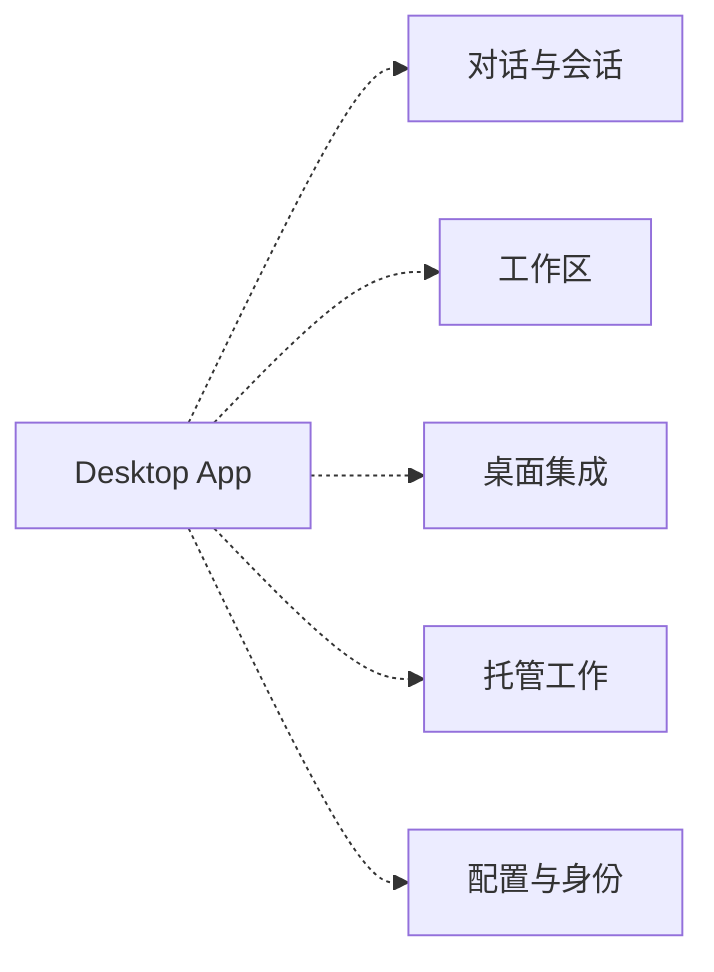

# Codex Desktop — 功能图谱

> 从已提交的研究模型生成。使用 `npm run docs:build` 更新，使用 `npm run docs:check` 校验。

App 归档：**26.903.61454**。OSS 参考：[`ddea03ad049142943bdbf13e937b1d67e8c1ba0c`](https://github.com/openai/codex/tree/ddea03ad049142943bdbf13e937b1d67e8c1ba0c)。应用二进制与该 OSS 提交的精确等价关系仍为**未验证**。

协议声明、包内字面量、静态调用点、界面截图和分析映射是独立的证据类型。字面量或调用表达式不证明执行；截图证明界面出现，不证明完整工作流；领域关联不自动构成依赖。

## 覆盖

| 指标 | 数值 |
| --- | --- |
| 发行包文件／解包字节 | 8,967 / 312.30 MB |
| 已解析 JavaScript 文件 | 7,262 / 7,262 |
| 导入引用／动态导入 | 26,219 / 4,343 |
| 内核方法／归档字面量命中 | 191 / 184 |
| 云路径／原始基线 | 350 / 343 |
| 桌面 IPC 通道 | 22 |
| 命令键／语言包 | 192 / 64 |
| 归档截图／匹配的 recapture 回执 | 42 / 23 |

## 限界上下文

上下文将相关产品概念归组，每个接口仍保留独立证据与执行边界。

### 对话与会话

会话是持久单元，轮次和条目描述其中的工作。本地与托管对话具有不同执行路径。

| 能力 | Core | Cloud | IPC |
| --- | --- | --- | --- |
| [会话生命周期](../site/three-way.html#cap-thread-lifecycle) | 78/78 | 49 | 0 |
| [记忆与个性化](../site/three-way.html#cap-memory) | 0/0 | 14 | 0 |

Core 单元格表示归档字面量命中／协议声明。本上下文包含 94 个命令键。

| 命令键 | 可读标签 |
| --- | --- |
| `codex.aboutDialog.buildInfoLabel` | 版本和构建信息 |
| `codex.aboutDialog.ok` | 确定 |
| `codex.aboutDialog.title` | 关于 {appName} |
| `codex.aboutDialog.versionLine` | 版本 {version} |
| `codex.aboutDialog.versionLineWithDate` | 版本 {version} • 发布于 {releaseDate} |
| `codex.command.archiveThread` | 归档聊天 |
| `codex.command.composer.startDictation` | 开始听写 |
| `codex.command.findInThread` | 查找 |
| `codex.command.focusBrowserAddressBar` | 聚焦浏览器地址栏 |
| `codex.command.logOut` | 注销 |
| `codex.command.navigateBack` | 返回 |
| `codex.command.navigateBrowserBack` | 浏览器返回 |
| `codex.command.navigateBrowserForward` | 浏览器前进 |
| `codex.command.navigateForward` | 前进 |
| `codex.command.newProjectlessTask` | 新建独立聊天 |
| `codex.command.newThread` | 新聊天 |
| `codex.command.nextThread` | 下一个聊天 |
| `codex.command.openBrowserTab` | 打开浏览器标签页 |
| `codex.command.openFolder` | 打开文件夹 |
| `codex.command.openPetOverlay` | 显示或隐藏虚拟宠物 |
| `codex.command.openThreadInNewWindow` | 在新窗口中打开 |
| `codex.command.previousThread` | 上一个聊天 |
| `codex.command.searchChats` | 切换聊天… |
| `codex.command.settings` | 设置 |
| `codex.command.showKeyboardShortcuts` | 显示键盘快捷键 |
| `codex.command.temporaryChat` | 新建临时聊天 |
| `codex.command.thread1` | 转到聊天 1 |
| `codex.command.thread2` | 转到聊天 2 |
| `codex.command.thread3` | 转到聊天 3 |
| `codex.command.thread4` | 转到聊天 4 |
| `codex.command.thread5` | 转到聊天 5 |
| `codex.command.thread6` | 转到聊天 6 |
| `codex.command.thread7` | 转到聊天 7 |
| `codex.command.thread8` | 转到聊天 8 |
| `codex.command.thread9` | 转到聊天 9 |
| `codex.command.toggleBottomPanel` | 切换底部面板 |
| `codex.command.togglePinnedSummary` | 切换置顶摘要 |
| `codex.command.toggleReviewPanel` | 切换审阅面板 |
| `codex.command.toggleSidebar` | 切换侧边栏 |
| `codex.command.toggleTerminal` | 打开终端 |
| `codex.command.toggleThreadPin` | 切换置顶状态 |
| `codex.commandMenu.fileSearchPlaceholder` | 搜索文件 |
| `codex.commandMenuTitle.archiveThread` | 归档聊天 |
| `codex.commandMenuTitle.closeTab` | 关闭标签页 |
| `codex.commandMenuTitle.closeWindow` | 关闭 |
| `codex.commandMenuTitle.composer.startDictation` | 听写 |
| `codex.commandMenuTitle.copyConversationPath` | 复制对话路径 |
| `codex.commandMenuTitle.copyDeeplink` | 复制深层链接 |
| `codex.commandMenuTitle.copyWorkingDirectory` | 复制工作目录 |
| `codex.commandMenuTitle.findInThread` | 查找 |
| `codex.commandMenuTitle.focusBrowserAddressBar` | 聚焦浏览器地址栏 |
| `codex.commandMenuTitle.hardReloadBrowserPage` | 强制重新加载浏览器页面 |
| `codex.commandMenuTitle.logOut` | 退出登录 |
| `codex.commandMenuTitle.navigateBack` | 返回 |
| `codex.commandMenuTitle.navigateForward` | 前进 |
| `codex.commandMenuTitle.newProjectlessTask` | 新建独立聊天 |
| `codex.commandMenuTitle.newThread` | 新聊天 |
| `codex.commandMenuTitle.newWindow` | 新窗口 |
| `codex.commandMenuTitle.nextThread` | 下一个聊天 |
| `codex.commandMenuTitle.openAvatarOverlay` | 显示虚拟宠物 |
| `codex.commandMenuTitle.openBrowserTab` | 打开浏览器标签页 |
| `codex.commandMenuTitle.openCommandMenu` | 打开命令菜单 |
| `codex.commandMenuTitle.openFolder` | 打开文件夹… |
| `codex.commandMenuTitle.openThreadInNewWindow` | 在新窗口中打开 |
| `codex.commandMenuTitle.previousThread` | 上一个聊天 |
| `codex.commandMenuTitle.reloadBrowserPage` | 重新加载浏览器页面 |
| `codex.commandMenuTitle.renameThread` | 重命名聊天 |
| `codex.commandMenuTitle.searchChats` | 搜索聊天… |
| `codex.commandMenuTitle.searchFiles` | 搜索文件… |
| `codex.commandMenuTitle.settings` | 设置… |
| `codex.commandMenuTitle.showKeyboardShortcuts` | 键盘快捷键 |
| `codex.commandMenuTitle.thread1` | 前往聊天 1 |
| `codex.commandMenuTitle.thread2` | 前往聊天 2 |
| `codex.commandMenuTitle.thread3` | 前往聊天 3 |
| `codex.commandMenuTitle.thread4` | 前往聊天 4 |
| `codex.commandMenuTitle.thread5` | 前往聊天 5 |
| `codex.commandMenuTitle.thread6` | 前往聊天 6 |
| `codex.commandMenuTitle.thread7` | 前往聊天 7 |
| `codex.commandMenuTitle.thread8` | 前往聊天 8 |
| `codex.commandMenuTitle.thread9` | 前往聊天 9 |
| `codex.commandMenuTitle.toggleBottomPanel` | 显示/隐藏底部面板 |
| `codex.commandMenuTitle.toggleFileTreePanel` | 显示/隐藏文件树 |
| `codex.commandMenuTitle.togglePinnedSummary` | 显示/隐藏固定摘要 |
| `codex.commandMenuTitle.toggleReviewPanel` | 显示/隐藏审阅面板 |
| `codex.commandMenuTitle.toggleSidebar` | 显示/隐藏侧边栏 |
| `codex.commandMenuTitle.toggleTerminal` | 打开终端 |
| `codex.commandMenuTitle.toggleThreadPin` | 置顶/取消置顶聊天 |
| `codex.commandMenuTitle.toggleTraceRecording` | 开始跟踪记录 |
| `codex.tabs.contextMenu.close` | 关闭 |
| `codex.threadFindBar.nextResult` | 下一个结果 |
| `codex.threadFindBar.previousResult` | 上一个结果 |
| `threadHeader.copySessionId` | 复制会话 ID |
| `threadHeader.copyWorkingDirectory` | 复制工作目录 |
| `thread.browser.reload` | 重新加载页面 |

### 工作区

审阅、终端、文件、浏览器和侧聊位于活动会话旁侧。面板是界面，并不等同于执行方。

| 能力 | Core | Cloud | IPC |
| --- | --- | --- | --- |
| [审批与权限闸门](../site/three-way.html#cap-approval) | 12/12 | 0 | 0 |
| [命令执行](../site/three-way.html#cap-exec) | 4/7 | 0 | 0 |
| [文件系统与搜索](../site/three-way.html#cap-fs) | 12/12 | 21 | 1 |
| [内嵌浏览器与计算机操作](../site/three-way.html#cap-browser) | 0/0 | 2 | 3 |

Core 单元格表示归档字面量命中／协议声明。本上下文包含 30 个命令键。

| 命令键 | 可读标签 |
| --- | --- |
| `browserSidebar.contextMenu.back` | 返回 |
| `browserSidebar.contextMenu.commentWithCodex` | 评论 |
| `browserSidebar.contextMenu.copyLink` | 复制链接地址 |
| `browserSidebar.contextMenu.forward` | 前进 |
| `browserSidebar.contextMenu.inspect` | 检查 |
| `browserSidebar.contextMenu.openExternalBrowser` | 在外部浏览器中打开 |
| `browserSidebar.contextMenu.openLinkInNewTab` | 在新标签页中打开链接 |
| `browserSidebar.contextMenu.reload` | 重新加载 |
| `browserSidebar.loadError.certificateSummary` | 无法验证 {host} 的证书 |
| `browserSidebar.loadError.checkConnection` | 检查网络连接 |
| `browserSidebar.loadError.checkProxyFirewallDns` | 检查代理、防火墙和 DNS 配置 |
| `browserSidebar.loadError.dnsBody` | 如果你不清楚这表示什么，请联系网络管理员 |
| `browserSidebar.loadError.dnsHeader` | 检查 DNS 设置 |
| `browserSidebar.loadError.dnsSummary` | 无法找到 {host} 的服务器 IP 地址 |
| `browserSidebar.loadError.genericSummary` | 无法加载 {host} |
| `browserSidebar.loadError.heading` | 无法访问此站点 |
| `browserSidebar.loadError.internetBody` | 检查所有线缆连接，并重启你当前使用的路由器、调制解调器或其他网络设备 |
| `browserSidebar.loadError.internetHeader` | 检查网络连接 |
| `browserSidebar.loadError.networkAccessBody` | 如果 {appName} 已在允许的应用列表中，请尝试将其从列表中移除，然后重新添加 |
| `browserSidebar.loadError.networkAccessHeader` | 在防火墙或安全设置中允许 {appName} 访问网络 |
| `browserSidebar.loadError.offlineSummary` | 无法加载 {host}，因为计算机处于离线状态 |
| `browserSidebar.loadError.proxyBody` | 打开系统网络设置，检查当前网络是否配置了代理 |
| `browserSidebar.loadError.proxyHeader` | 如果使用代理服务器 |
| `browserSidebar.loadError.refusedSummary` | {host} 拒绝建立连接 |
| `browserSidebar.loadError.reload` | 重新加载 |
| `browserSidebar.loadError.timeoutSummary` | {host} 响应超时 |
| `browserSidebar.loadError.try` | 尝试： |
| `browserSidebar.zoomBanner.zoomIn` | 放大 |
| `browserSidebar.zoomBanner.zoomOut` | 缩小 |
| `review.fileSource.browser.toggleFileTree` | 切换文件树 |

### 桌面集成

窗口编排与原生桥将 Web 界面连接到操作系统和子进程。

| 能力 | Core | Cloud | IPC |
| --- | --- | --- | --- |
| [窗口与系统集成](../site/three-way.html#cap-shell-ui) | 0/0 | 0 | 8 |
| [渲染层传输管道](../site/three-way.html#cap-transport) | 0/0 | 0 | 2 |
| [沙箱与远程控制](../site/three-way.html#cap-sandbox-windows) | 7/7 | 0 | 0 |

Core 单元格表示归档字面量命中／协议声明。本上下文包含 47 个命令键。

| 命令键 | 可读标签 |
| --- | --- |
| `electron.appMenu.app.checkForUpdates` | 检查更新… |
| `electron.appMenu.app.hide` | 隐藏 {appName} |
| `electron.appMenu.app.hideOthers` | 隐藏其他 |
| `electron.appMenu.app.quit` | 退出 {appName} |
| `electron.appMenu.app.services` | 服务 |
| `electron.appMenu.app.showAll` | 显示全部 |
| `electron.appMenu.edit.copy` | 复制 |
| `electron.appMenu.edit.cut` | 剪切 |
| `electron.appMenu.edit.delete` | 删除 |
| `electron.appMenu.edit.paste` | 粘贴 |
| `electron.appMenu.edit.pasteAndMatchStyle` | 粘贴并匹配样式 |
| `electron.appMenu.edit.redo` | 重做 |
| `electron.appMenu.edit.selectAll` | 全选 |
| `electron.appMenu.edit.showSubstitutions` | 显示替换 |
| `electron.appMenu.edit.smartDashes` | 智能破折号 |
| `electron.appMenu.edit.smartQuotes` | 智能引号 |
| `electron.appMenu.edit.speech` | 语音 |
| `electron.appMenu.edit.startSpeaking` | 开始朗读 |
| `electron.appMenu.edit.stopSpeaking` | 停止朗读 |
| `electron.appMenu.edit.substitutions` | 替换 |
| `electron.appMenu.edit.textReplacement` | 文本替换 |
| `electron.appMenu.edit.undo` | 撤销 |
| `electron.appMenu.file.newWindow` | 新建窗口 |
| `electron.appMenu.help.systemStatus` | 系统状态 |
| `electron.appMenu.help.taskManager` | 任务管理器 |
| `electron.appMenu.help.troubleshooting` | 故障排除 |
| `electron.appMenu.trace.awaitingDetails` | 正在等待跟踪详情… |
| `electron.appMenu.trace.awaitingStart` | 等待开始跟踪… |
| `electron.appMenu.trace.saving` | 正在保存跟踪… |
| `electron.appMenu.trace.start` | 开始性能跟踪 |
| `electron.appMenu.trace.stop` | 停止性能跟踪 |
| `electron.appMenu.trace.uploading` | 正在上传跟踪… |
| `electron.appMenu.view.actualSize` | 实际大小 |
| `electron.appMenu.view.reloadWindow` | 重新加载窗口 |
| `electron.appMenu.view.toggleFullScreen` | 切换全屏 |
| `electron.appMenu.window` | 窗口 |
| `electron.appMenu.window.bringAllToFront` | 全部置于顶层 |
| `electron.appMenu.window.minimize` | 最小化 |
| `electron.appMenu.window.zoom` | 缩放 |
| `appHeader.installUpdate.confirmCancel` | 取消 |
| `appHeader.installUpdate.confirmInstall` | 更新 |
| `appHeader.installUpdate.confirmSubtitle` | {appName} 将退出以安装更新，这会中断此设备上当前活动的本地会话 |
| `appHeader.installUpdate.confirmTitle` | 现在更新 {appName}？ |
| `windowsMenuBar.edit` | 编辑 |
| `windowsMenuBar.file` | 文件 |
| `windowsMenuBar.help` | 帮助 |
| `windowsMenuBar.view` | 视图 |

### 托管工作

发行包包含面向云端的任务、Agent 和计划接口。已截取目的地并不表示完整工作流已被验证。

| 能力 | Core | Cloud | IPC |
| --- | --- | --- | --- |
| [云任务与代码评审](../site/three-way.html#cap-cloud-tasks) | 1/1 | 66 | 0 |
| [托管 Agent 与小组件](../site/three-way.html#cap-agents) | 0/0 | 36 | 0 |
| [自动化与定时任务](../site/three-way.html#cap-automation) | 0/0 | 6 | 0 |

Core 单元格表示归档字面量命中／协议声明。本上下文包含 17 个命令键。

| 命令键 | 可读标签 |
| --- | --- |
| `desktop.intelLaunchWarning.continue` | 仍要继续 |
| `desktop.intelLaunchWarning.detail` | 此版本可通过 Rosetta 运行，但 Apple Silicon 版本启动更快、表现更好。立即退出以安装 Apple Silicon 版本，或继续使用 Intel 版本 |
| `desktop.intelLaunchWarning.message` | {appName} 当前在 Apple Silicon Mac 上运行的是 Intel 版本 |
| `desktop.intelLaunchWarning.quit` | 退出 |
| `desktop.quitConfirmation.activeLocalAndScheduledTasksDetail` | 本机上已开启的本地聊天将会中断，且在 {appName} 关闭期间，已安排的任务不会运行 |
| `desktop.quitConfirmation.activeLocalTasksDetail` | 本机正在进行的本地聊天将被中断 |
| `desktop.quitConfirmation.cancel` | 取消 |
| `desktop.quitConfirmation.quit` | 退出 |
| `desktop.quitConfirmation.scheduledTasksDetail` | {appName} 关闭期间，已安排的任务不会运行 |
| `desktop.quitConfirmation.title` | 退出 {appName}？ |
| `desktop.remoteHostedPIP.closeControlTooltip` | 将画中画返回 Codex |
| `desktop.remoteHostedPIP.hideControl` | 隐藏 |
| `desktop.remoteHostedPIP.hideForAllActiveTasks` | 对所有已开启的聊天隐藏 |
| `desktop.remoteHostedPIP.hideForTask` | 在此聊天中隐藏 |
| `desktop.remoteHostedPIP.sendToPetControlTooltip` | 将画中画发送至虚拟宠物 |
| `sidebarElectron.renameThread` | 重命名聊天 |
| `sidebarHelp.whatsNew` | 新功能 |

### 配置与身份

设置将协议配置、账号服务与系统权限汇聚在一起，每一项仍有自己的实现边界。

| 能力 | Core | Cloud | IPC |
| --- | --- | --- | --- |
| [扩展体系](../site/three-way.html#cap-extensions) | 33/35 | 53 | 3 |
| [账号与授权](../site/three-way.html#cap-account) | 10/12 | 55 | 0 |
| [配置与模型](../site/three-way.html#cap-config) | 26/26 | 10 | 2 |
| [遥测与反馈](../site/three-way.html#cap-telemetry) | 1/1 | 2 | 3 |
| [设备认证与滥用防护](../site/three-way.html#cap-trust) | 0/0 | 8 | 0 |
| [宠物与增长功能](../site/three-way.html#cap-growth) | 0/0 | 21 | 0 |

Core 单元格表示归档字面量命中／协议声明。本上下文包含 2 个命令键。

| 命令键 | 可读标签 |
| --- | --- |
| `plugins.detail.information.developer` | 开发者 |
| `settings.nav.browser-use` | 浏览器 |

## 未归类命令键

- `artifactFeedback.button.label`
- `loadingPage.documentationLink`

中文标签来自原生菜单语言 JSON。本快照没有英文原生菜单语言文件，因此英文标签是命令键的可读展开，不作为已截取的英文 UI 文案。

## 内核接口索引

| 方法 | 方向 | 包内字面量 | 输入类型 |
| --- | --- | --- | --- |
| [`account/chatgptAuthTokens/refresh`](https://github.com/openai/codex/blob/ddea03ad049142943bdbf13e937b1d67e8c1ba0c/codex-rs/app-server-protocol/src/protocol/common.rs#L1777-L1780) | core → app | 已发现 | `ChatgptAuthTokensRefreshParams` |
| [`account/login/cancel`](https://github.com/openai/codex/blob/ddea03ad049142943bdbf13e937b1d67e8c1ba0c/codex-rs/app-server-protocol/src/protocol/common.rs#L1273-L1277) | app → core | 已发现 | `CancelLoginAccountParams` |
| [`account/login/completed`](https://github.com/openai/codex/blob/ddea03ad049142943bdbf13e937b1d67e8c1ba0c/codex-rs/app-server-protocol/schema/json/codex_app_server_protocol.v2.schemas.json#L17228-L17237) | core → app | 已发现 | `AccountLoginCompletedNotification` |
| [`account/login/start`](https://github.com/openai/codex/blob/ddea03ad049142943bdbf13e937b1d67e8c1ba0c/codex-rs/app-server-protocol/src/protocol/common.rs#L1252-L1257) | app → core | 已发现 | `LoginAccountParams` |
| [`account/logout`](https://github.com/openai/codex/blob/ddea03ad049142943bdbf13e937b1d67e8c1ba0c/codex-rs/app-server-protocol/src/protocol/common.rs#L1279-L1283) | app → core | 已发现 | `—` |
| [`account/rateLimitResetCredit/consume`](https://github.com/openai/codex/blob/ddea03ad049142943bdbf13e937b1d67e8c1ba0c/codex-rs/app-server-protocol/src/protocol/common.rs#L1291-L1295) | app → core | 已发现 | `ConsumeAccountRateLimitResetCreditParams` |
| [`account/rateLimits/read`](https://github.com/openai/codex/blob/ddea03ad049142943bdbf13e937b1d67e8c1ba0c/codex-rs/app-server-protocol/src/protocol/common.rs#L1285-L1289) | app → core | 已发现 | `GetAccountRateLimitsParams` |
| [`account/rateLimits/updated`](https://github.com/openai/codex/blob/ddea03ad049142943bdbf13e937b1d67e8c1ba0c/codex-rs/app-server-protocol/src/protocol/common.rs#L1958-L1975) | core → app | 已发现 | `AccountRateLimitsUpdatedNotification` |
| [`account/read`](https://github.com/openai/codex/blob/ddea03ad049142943bdbf13e937b1d67e8c1ba0c/codex-rs/app-server-protocol/src/protocol/common.rs#L1419-L1423) | app → core | 已发现 | `GetAccountParams` |
| [`account/sendAddCreditsNudgeEmail`](https://github.com/openai/codex/blob/ddea03ad049142943bdbf13e937b1d67e8c1ba0c/codex-rs/app-server-protocol/src/protocol/common.rs#L1309-L1313) | app → core | 未发现 | `SendAddCreditsNudgeEmailParams` |
| [`account/updated`](https://github.com/openai/codex/blob/ddea03ad049142943bdbf13e937b1d67e8c1ba0c/codex-rs/app-server-protocol/src/protocol/common.rs#L1957-L1974) | core → app | 已发现 | `AccountUpdatedNotification` |
| [`account/usage/read`](https://github.com/openai/codex/blob/ddea03ad049142943bdbf13e937b1d67e8c1ba0c/codex-rs/app-server-protocol/src/protocol/common.rs#L1297-L1301) | app → core | 已发现 | `GetAccountTokenUsageParams` |
| [`account/workspaceMessages/read`](https://github.com/openai/codex/blob/ddea03ad049142943bdbf13e937b1d67e8c1ba0c/codex-rs/app-server-protocol/src/protocol/common.rs#L1303-L1307) | app → core | 未发现 | `—` |
| [`app/installed`](https://github.com/openai/codex/blob/ddea03ad049142943bdbf13e937b1d67e8c1ba0c/codex-rs/app-server-protocol/src/protocol/common.rs#L956-L960) | app → core | 已发现 | `AppsInstalledParams` |
| [`app/list`](https://github.com/openai/codex/blob/ddea03ad049142943bdbf13e937b1d67e8c1ba0c/codex-rs/app-server-protocol/src/protocol/common.rs#L951-L955) | app → core | 已发现 | `AppsListParams` |
| [`app/list/updated`](https://github.com/openai/codex/blob/ddea03ad049142943bdbf13e937b1d67e8c1ba0c/codex-rs/app-server-protocol/src/protocol/common.rs#L1959-L1976) | core → app | 已发现 | `AppListUpdatedNotification` |
| [`app/read`](https://github.com/openai/codex/blob/ddea03ad049142943bdbf13e937b1d67e8c1ba0c/codex-rs/app-server-protocol/src/protocol/common.rs#L946-L950) | app → core | 已发现 | `AppsReadParams` |
| [`applyPatchApproval`](https://github.com/openai/codex/blob/ddea03ad049142943bdbf13e937b1d67e8c1ba0c/codex-rs/app-server-protocol/schema/json/codex_app_server_protocol.schemas.json#L6324-L6333) | core → app | 已发现 | `ApplyPatchApprovalParams` |
| [`attestation/generate`](https://github.com/openai/codex/blob/ddea03ad049142943bdbf13e937b1d67e8c1ba0c/codex-rs/app-server-protocol/src/protocol/common.rs#L1783-L1786) | core → app | 已发现 | `AttestationGenerateParams` |
| [`autoApprovalReview/strictReviewRequired`](https://github.com/openai/codex/blob/ddea03ad049142943bdbf13e937b1d67e8c1ba0c/codex-rs/app-server-protocol/src/protocol/common.rs#L1929-L1949) | core → app | 已发现 | `StrictReviewRequiredNotification` |
| [`command/exec`](https://github.com/openai/codex/blob/ddea03ad049142943bdbf13e937b1d67e8c1ba0c/codex-rs/app-server-protocol/src/protocol/common.rs#L1322-L1327) | app → core | 已发现 | `CommandExecParams` |
| [`command/exec/outputDelta`](https://github.com/openai/codex/blob/ddea03ad049142943bdbf13e937b1d67e8c1ba0c/codex-rs/app-server-protocol/src/protocol/common.rs#L1939-L1957) | core → app | 已发现 | `CommandExecOutputDeltaNotification` |
| [`command/exec/resize`](https://github.com/openai/codex/blob/ddea03ad049142943bdbf13e937b1d67e8c1ba0c/codex-rs/app-server-protocol/src/protocol/common.rs#L1341-L1345) | app → core | 未发现 | `CommandExecResizeParams` |
| [`command/exec/terminate`](https://github.com/openai/codex/blob/ddea03ad049142943bdbf13e937b1d67e8c1ba0c/codex-rs/app-server-protocol/src/protocol/common.rs#L1335-L1339) | app → core | 未发现 | `CommandExecTerminateParams` |
| [`command/exec/write`](https://github.com/openai/codex/blob/ddea03ad049142943bdbf13e937b1d67e8c1ba0c/codex-rs/app-server-protocol/src/protocol/common.rs#L1329-L1333) | app → core | 未发现 | `CommandExecWriteParams` |
| [`config/batchWrite`](https://github.com/openai/codex/blob/ddea03ad049142943bdbf13e937b1d67e8c1ba0c/codex-rs/app-server-protocol/src/protocol/common.rs#L1406-L1411) | app → core | 已发现 | `ConfigBatchWriteParams` |
| [`config/mcpServer/reload`](https://github.com/openai/codex/blob/ddea03ad049142943bdbf13e937b1d67e8c1ba0c/codex-rs/app-server-protocol/src/protocol/common.rs#L1203-L1207) | app → core | 已发现 | `—` |
| [`config/read`](https://github.com/openai/codex/blob/ddea03ad049142943bdbf13e937b1d67e8c1ba0c/codex-rs/app-server-protocol/src/protocol/common.rs#L1375-L1379) | app → core | 已发现 | `ConfigReadParams` |
| [`config/value/write`](https://github.com/openai/codex/blob/ddea03ad049142943bdbf13e937b1d67e8c1ba0c/codex-rs/app-server-protocol/src/protocol/common.rs#L1400-L1405) | app → core | 已发现 | `ConfigValueWriteParams` |
| [`configRequirements/read`](https://github.com/openai/codex/blob/ddea03ad049142943bdbf13e937b1d67e8c1ba0c/codex-rs/app-server-protocol/src/protocol/common.rs#L1413-L1417) | app → core | 已发现 | `—` |
| [`configWarning`](https://github.com/openai/codex/blob/ddea03ad049142943bdbf13e937b1d67e8c1ba0c/codex-rs/app-server-protocol/src/protocol/common.rs#L1979-L1997) | core → app | 已发现 | `ConfigWarningNotification` |
| [`deprecationNotice`](https://github.com/openai/codex/blob/ddea03ad049142943bdbf13e937b1d67e8c1ba0c/codex-rs/app-server-protocol/src/protocol/common.rs#L1978-L1997) | core → app | 已发现 | `DeprecationNoticeNotification` |
| [`error`](https://github.com/openai/codex/blob/ddea03ad049142943bdbf13e937b1d67e8c1ba0c/codex-rs/app-server-protocol/src/protocol/common.rs#L1894-L1916) | core → app | 已发现 | `ErrorNotification` |
| [`execCommandApproval`](https://github.com/openai/codex/blob/ddea03ad049142943bdbf13e937b1d67e8c1ba0c/codex-rs/app-server-protocol/schema/json/codex_app_server_protocol.schemas.json#L6349-L6358) | core → app | 已发现 | `ExecCommandApprovalParams` |
| [`experimentalFeature/enablement/set`](https://github.com/openai/codex/blob/ddea03ad049142943bdbf13e937b1d67e8c1ba0c/codex-rs/app-server-protocol/src/protocol/common.rs#L1114-L1118) | app → core | 已发现 | `ExperimentalFeatureEnablementSetParams` |
| [`experimentalFeature/list`](https://github.com/openai/codex/blob/ddea03ad049142943bdbf13e937b1d67e8c1ba0c/codex-rs/app-server-protocol/src/protocol/common.rs#L1104-L1108) | app → core | 已发现 | `ExperimentalFeatureListParams` |
| [`externalAgentConfig/detect`](https://github.com/openai/codex/blob/ddea03ad049142943bdbf13e937b1d67e8c1ba0c/codex-rs/app-server-protocol/src/protocol/common.rs#L1380-L1384) | app → core | 已发现 | `ExternalAgentConfigDetectParams` |
| [`externalAgentConfig/import`](https://github.com/openai/codex/blob/ddea03ad049142943bdbf13e937b1d67e8c1ba0c/codex-rs/app-server-protocol/src/protocol/common.rs#L1385-L1389) | app → core | 已发现 | `ExternalAgentConfigImportParams` |
| [`externalAgentConfig/import/completed`](https://github.com/openai/codex/blob/ddea03ad049142943bdbf13e937b1d67e8c1ba0c/codex-rs/app-server-protocol/src/protocol/common.rs#L1962-L1980) | core → app | 已发现 | `ExternalAgentConfigImportCompletedNotification` |
| [`externalAgentConfig/import/progress`](https://github.com/openai/codex/blob/ddea03ad049142943bdbf13e937b1d67e8c1ba0c/codex-rs/app-server-protocol/src/protocol/common.rs#L1961-L1979) | core → app | 已发现 | `ExternalAgentConfigImportProgressNotification` |
| [`externalAgentConfig/import/readHistories`](https://github.com/openai/codex/blob/ddea03ad049142943bdbf13e937b1d67e8c1ba0c/codex-rs/app-server-protocol/src/protocol/common.rs#L1395-L1399) | app → core | 已发现 | `—` |
| [`externalAgentConfig/import/recordHistory`](https://github.com/openai/codex/blob/ddea03ad049142943bdbf13e937b1d67e8c1ba0c/codex-rs/app-server-protocol/src/protocol/common.rs#L1390-L1394) | app → core | 已发现 | `ExternalAgentConfigImportHistoryRecordParams` |
| [`feedback/upload`](https://github.com/openai/codex/blob/ddea03ad049142943bdbf13e937b1d67e8c1ba0c/codex-rs/app-server-protocol/src/protocol/common.rs#L1315-L1319) | app → core | 已发现 | `FeedbackUploadParams` |
| [`fs/changed`](https://github.com/openai/codex/blob/ddea03ad049142943bdbf13e937b1d67e8c1ba0c/codex-rs/app-server-protocol/src/protocol/common.rs#L1963-L1981) | core → app | 已发现 | `FsChangedNotification` |
| [`fs/copy`](https://github.com/openai/codex/blob/ddea03ad049142943bdbf13e937b1d67e8c1ba0c/codex-rs/app-server-protocol/src/protocol/common.rs#L993-L997) | app → core | 已发现 | `FsCopyParams` |
| [`fs/createDirectory`](https://github.com/openai/codex/blob/ddea03ad049142943bdbf13e937b1d67e8c1ba0c/codex-rs/app-server-protocol/src/protocol/common.rs#L973-L977) | app → core | 已发现 | `FsCreateDirectoryParams` |
| [`fs/getMetadata`](https://github.com/openai/codex/blob/ddea03ad049142943bdbf13e937b1d67e8c1ba0c/codex-rs/app-server-protocol/src/protocol/common.rs#L978-L982) | app → core | 已发现 | `FsGetMetadataParams` |
| [`fs/readDirectory`](https://github.com/openai/codex/blob/ddea03ad049142943bdbf13e937b1d67e8c1ba0c/codex-rs/app-server-protocol/src/protocol/common.rs#L983-L987) | app → core | 已发现 | `FsReadDirectoryParams` |
| [`fs/readFile`](https://github.com/openai/codex/blob/ddea03ad049142943bdbf13e937b1d67e8c1ba0c/codex-rs/app-server-protocol/src/protocol/common.rs#L963-L967) | app → core | 已发现 | `FsReadFileParams` |
| [`fs/remove`](https://github.com/openai/codex/blob/ddea03ad049142943bdbf13e937b1d67e8c1ba0c/codex-rs/app-server-protocol/src/protocol/common.rs#L988-L992) | app → core | 已发现 | `FsRemoveParams` |
| [`fs/unwatch`](https://github.com/openai/codex/blob/ddea03ad049142943bdbf13e937b1d67e8c1ba0c/codex-rs/app-server-protocol/src/protocol/common.rs#L1003-L1007) | app → core | 已发现 | `FsUnwatchParams` |
| [`fs/watch`](https://github.com/openai/codex/blob/ddea03ad049142943bdbf13e937b1d67e8c1ba0c/codex-rs/app-server-protocol/src/protocol/common.rs#L998-L1002) | app → core | 已发现 | `FsWatchParams` |
| [`fs/writeFile`](https://github.com/openai/codex/blob/ddea03ad049142943bdbf13e937b1d67e8c1ba0c/codex-rs/app-server-protocol/src/protocol/common.rs#L968-L972) | app → core | 已发现 | `FsWriteFileParams` |
| [`fuzzyFileSearch`](https://github.com/openai/codex/blob/ddea03ad049142943bdbf13e937b1d67e8c1ba0c/codex-rs/app-server-protocol/src/protocol/common.rs#L1444-L1448) | app → core | 已发现 | `FuzzyFileSearchParams` |
| [`fuzzyFileSearch/sessionCompleted`](https://github.com/openai/codex/blob/ddea03ad049142943bdbf13e937b1d67e8c1ba0c/codex-rs/app-server-protocol/src/protocol/common.rs#L1981-L2000) | core → app | 已发现 | `FuzzyFileSearchSessionCompletedNotification` |
| [`fuzzyFileSearch/sessionUpdated`](https://github.com/openai/codex/blob/ddea03ad049142943bdbf13e937b1d67e8c1ba0c/codex-rs/app-server-protocol/src/protocol/common.rs#L1980-L1999) | core → app | 已发现 | `FuzzyFileSearchSessionUpdatedNotification` |
| [`guardianWarning`](https://github.com/openai/codex/blob/ddea03ad049142943bdbf13e937b1d67e8c1ba0c/codex-rs/app-server-protocol/src/protocol/common.rs#L1977-L1995) | core → app | 已发现 | `GuardianWarningNotification` |
| [`hook/completed`](https://github.com/openai/codex/blob/ddea03ad049142943bdbf13e937b1d67e8c1ba0c/codex-rs/app-server-protocol/src/protocol/common.rs#L1922-L1940) | core → app | 已发现 | `HookCompletedNotification` |
| [`hook/started`](https://github.com/openai/codex/blob/ddea03ad049142943bdbf13e937b1d67e8c1ba0c/codex-rs/app-server-protocol/src/protocol/common.rs#L1920-L1939) | core → app | 已发现 | `HookStartedNotification` |
| [`hooks/list`](https://github.com/openai/codex/blob/ddea03ad049142943bdbf13e937b1d67e8c1ba0c/codex-rs/app-server-protocol/src/protocol/common.rs#L870-L874) | app → core | 已发现 | `HooksListParams` |
| [`initialize`](https://github.com/openai/codex/blob/ddea03ad049142943bdbf13e937b1d67e8c1ba0c/codex-rs/app-server-protocol/src/protocol/common.rs#L507-L511) | app → core | 已发现 | `InitializeParams` |
| [`initialized`](https://github.com/openai/codex/blob/ddea03ad049142943bdbf13e937b1d67e8c1ba0c/codex-rs/app-server-protocol/schema/json/codex_app_server_protocol.schemas.json#L182-L191) | app → core | 已发现 | `—` |
| [`item/agentMessage/delta`](https://github.com/openai/codex/blob/ddea03ad049142943bdbf13e937b1d67e8c1ba0c/codex-rs/app-server-protocol/src/protocol/common.rs#L1935-L1954) | core → app | 已发现 | `AgentMessageDeltaNotification` |
| [`item/autoApprovalReview/completed`](https://github.com/openai/codex/blob/ddea03ad049142943bdbf13e937b1d67e8c1ba0c/codex-rs/app-server-protocol/src/protocol/common.rs#L1927-L1947) | core → app | 已发现 | `ItemGuardianApprovalReviewCompletedNotification` |
| [`item/autoApprovalReview/started`](https://github.com/openai/codex/blob/ddea03ad049142943bdbf13e937b1d67e8c1ba0c/codex-rs/app-server-protocol/src/protocol/common.rs#L1926-L1945) | core → app | 已发现 | `ItemGuardianApprovalReviewStartedNotification` |
| [`item/commandExecution/outputDelta`](https://github.com/openai/codex/blob/ddea03ad049142943bdbf13e937b1d67e8c1ba0c/codex-rs/app-server-protocol/src/protocol/common.rs#L1946-L1962) | core → app | 已发现 | `CommandExecutionOutputDeltaNotification` |
| [`item/commandExecution/requestApproval`](https://github.com/openai/codex/blob/ddea03ad049142943bdbf13e937b1d67e8c1ba0c/codex-rs/app-server-protocol/src/protocol/common.rs#L1741-L1744) | core → app | 已发现 | `CommandExecutionRequestApprovalParams` |
| [`item/commandExecution/terminalInteraction`](https://github.com/openai/codex/blob/ddea03ad049142943bdbf13e937b1d67e8c1ba0c/codex-rs/app-server-protocol/src/protocol/common.rs#L1947-L1963) | core → app | 已发现 | `TerminalInteractionNotification` |
| [`item/completed`](https://github.com/openai/codex/blob/ddea03ad049142943bdbf13e937b1d67e8c1ba0c/codex-rs/app-server-protocol/src/protocol/common.rs#L1930-L1950) | core → app | 已发现 | `ItemCompletedNotification` |
| [`item/fileChange/outputDelta`](https://github.com/openai/codex/blob/ddea03ad049142943bdbf13e937b1d67e8c1ba0c/codex-rs/app-server-protocol/src/protocol/common.rs#L1949-L1965) | core → app | 已发现 | `FileChangeOutputDeltaNotification` |
| [`item/fileChange/patchUpdated`](https://github.com/openai/codex/blob/ddea03ad049142943bdbf13e937b1d67e8c1ba0c/codex-rs/app-server-protocol/src/protocol/common.rs#L1950-L1966) | core → app | 已发现 | `FileChangePatchUpdatedNotification` |
| [`item/fileChange/requestApproval`](https://github.com/openai/codex/blob/ddea03ad049142943bdbf13e937b1d67e8c1ba0c/codex-rs/app-server-protocol/src/protocol/common.rs#L1748-L1751) | core → app | 已发现 | `FileChangeRequestApprovalParams` |
| [`item/mcpToolCall/progress`](https://github.com/openai/codex/blob/ddea03ad049142943bdbf13e937b1d67e8c1ba0c/codex-rs/app-server-protocol/src/protocol/common.rs#L1952-L1968) | core → app | 已发现 | `McpToolCallProgressNotification` |
| [`item/permissions/requestApproval`](https://github.com/openai/codex/blob/ddea03ad049142943bdbf13e937b1d67e8c1ba0c/codex-rs/app-server-protocol/src/protocol/common.rs#L1766-L1769) | core → app | 已发现 | `PermissionsRequestApprovalParams` |
| [`item/plan/delta`](https://github.com/openai/codex/blob/ddea03ad049142943bdbf13e937b1d67e8c1ba0c/codex-rs/app-server-protocol/src/protocol/common.rs#L1937-L1956) | core → app | 已发现 | `PlanDeltaNotification` |
| [`item/reasoning/summaryPartAdded`](https://github.com/openai/codex/blob/ddea03ad049142943bdbf13e937b1d67e8c1ba0c/codex-rs/app-server-protocol/src/protocol/common.rs#L1965-L1984) | core → app | 已发现 | `ReasoningSummaryPartAddedNotification` |
| [`item/reasoning/summaryTextDelta`](https://github.com/openai/codex/blob/ddea03ad049142943bdbf13e937b1d67e8c1ba0c/codex-rs/app-server-protocol/src/protocol/common.rs#L1964-L1983) | core → app | 已发现 | `ReasoningSummaryTextDeltaNotification` |
| [`item/reasoning/textDelta`](https://github.com/openai/codex/blob/ddea03ad049142943bdbf13e937b1d67e8c1ba0c/codex-rs/app-server-protocol/src/protocol/common.rs#L1966-L1985) | core → app | 已发现 | `ReasoningTextDeltaNotification` |
| [`item/started`](https://github.com/openai/codex/blob/ddea03ad049142943bdbf13e937b1d67e8c1ba0c/codex-rs/app-server-protocol/src/protocol/common.rs#L1925-L1944) | core → app | 已发现 | `ItemStartedNotification` |
| [`item/tool/call`](https://github.com/openai/codex/blob/ddea03ad049142943bdbf13e937b1d67e8c1ba0c/codex-rs/app-server-protocol/src/protocol/common.rs#L1772-L1775) | core → app | 已发现 | `DynamicToolCallParams` |
| [`item/tool/requestUserInput`](https://github.com/openai/codex/blob/ddea03ad049142943bdbf13e937b1d67e8c1ba0c/codex-rs/app-server-protocol/src/protocol/common.rs#L1754-L1757) | core → app | 已发现 | `ToolRequestUserInputParams` |
| [`marketplace/add`](https://github.com/openai/codex/blob/ddea03ad049142943bdbf13e937b1d67e8c1ba0c/codex-rs/app-server-protocol/src/protocol/common.rs#L875-L879) | app → core | 已发现 | `MarketplaceAddParams` |
| [`marketplace/remove`](https://github.com/openai/codex/blob/ddea03ad049142943bdbf13e937b1d67e8c1ba0c/codex-rs/app-server-protocol/src/protocol/common.rs#L880-L884) | app → core | 已发现 | `MarketplaceRemoveParams` |
| [`marketplace/upgrade`](https://github.com/openai/codex/blob/ddea03ad049142943bdbf13e937b1d67e8c1ba0c/codex-rs/app-server-protocol/src/protocol/common.rs#L885-L889) | app → core | 已发现 | `MarketplaceUpgradeParams` |
| [`mcpServer/elicitation/request`](https://github.com/openai/codex/blob/ddea03ad049142943bdbf13e937b1d67e8c1ba0c/codex-rs/app-server-protocol/src/protocol/common.rs#L1760-L1763) | core → app | 已发现 | `McpServerElicitationRequestParams` |
| [`mcpServer/event/stream/notification`](https://github.com/openai/codex/blob/ddea03ad049142943bdbf13e937b1d67e8c1ba0c/codex-rs/app-server-protocol/src/protocol/common.rs#L1956-L1973) | core → app | 已发现 | `McpServerEventStreamNotification` |
| [`mcpServer/oauth/login`](https://github.com/openai/codex/blob/ddea03ad049142943bdbf13e937b1d67e8c1ba0c/codex-rs/app-server-protocol/src/protocol/common.rs#L1197-L1201) | app → core | 已发现 | `McpServerOauthLoginParams` |
| [`mcpServer/oauthLogin/completed`](https://github.com/openai/codex/blob/ddea03ad049142943bdbf13e937b1d67e8c1ba0c/codex-rs/app-server-protocol/src/protocol/common.rs#L1953-L1970) | core → app | 已发现 | `McpServerOauthLoginCompletedNotification` |
| [`mcpServer/resource/read`](https://github.com/openai/codex/blob/ddea03ad049142943bdbf13e937b1d67e8c1ba0c/codex-rs/app-server-protocol/src/protocol/common.rs#L1215-L1219) | app → core | 已发现 | `McpResourceReadParams` |
| [`mcpServer/startupStatus/updated`](https://github.com/openai/codex/blob/ddea03ad049142943bdbf13e937b1d67e8c1ba0c/codex-rs/app-server-protocol/src/protocol/common.rs#L1954-L1971) | core → app | 已发现 | `McpServerStatusUpdatedNotification` |
| [`mcpServer/tool/call`](https://github.com/openai/codex/blob/ddea03ad049142943bdbf13e937b1d67e8c1ba0c/codex-rs/app-server-protocol/src/protocol/common.rs#L1235-L1239) | app → core | 已发现 | `McpServerToolCallParams` |
| [`mcpServerStatus/list`](https://github.com/openai/codex/blob/ddea03ad049142943bdbf13e937b1d67e8c1ba0c/codex-rs/app-server-protocol/src/protocol/common.rs#L1209-L1213) | app → core | 已发现 | `ListMcpServerStatusParams` |
| [`model/list`](https://github.com/openai/codex/blob/ddea03ad049142943bdbf13e937b1d67e8c1ba0c/codex-rs/app-server-protocol/src/protocol/common.rs#L1094-L1098) | app → core | 已发现 | `ModelListParams` |
| [`model/rerouted`](https://github.com/openai/codex/blob/ddea03ad049142943bdbf13e937b1d67e8c1ba0c/codex-rs/app-server-protocol/src/protocol/common.rs#L1969-L1988) | core → app | 已发现 | `ModelReroutedNotification` |
| [`model/safetyBuffering/updated`](https://github.com/openai/codex/blob/ddea03ad049142943bdbf13e937b1d67e8c1ba0c/codex-rs/app-server-protocol/src/protocol/common.rs#L1975-L1994) | core → app | 已发现 | `ModelSafetyBufferingUpdatedNotification` |
| [`model/verification`](https://github.com/openai/codex/blob/ddea03ad049142943bdbf13e937b1d67e8c1ba0c/codex-rs/app-server-protocol/src/protocol/common.rs#L1970-L1989) | core → app | 已发现 | `ModelVerificationNotification` |
| [`modelProvider/authRecoveryCompleted`](https://github.com/openai/codex/blob/ddea03ad049142943bdbf13e937b1d67e8c1ba0c/codex-rs/app-server-protocol/src/protocol/common.rs#L1972-L1991) | core → app | 已发现 | `AuthRecoveryNotification` |
| [`modelProvider/authRecoveryStarted`](https://github.com/openai/codex/blob/ddea03ad049142943bdbf13e937b1d67e8c1ba0c/codex-rs/app-server-protocol/src/protocol/common.rs#L1971-L1990) | core → app | 已发现 | `AuthRecoveryNotification` |
| [`modelProvider/capabilities/read`](https://github.com/openai/codex/blob/ddea03ad049142943bdbf13e937b1d67e8c1ba0c/codex-rs/app-server-protocol/src/protocol/common.rs#L1099-L1103) | app → core | 已发现 | `ModelProviderCapabilitiesReadParams` |
| [`permissionProfile/list`](https://github.com/openai/codex/blob/ddea03ad049142943bdbf13e937b1d67e8c1ba0c/codex-rs/app-server-protocol/src/protocol/common.rs#L1109-L1113) | app → core | 已发现 | `PermissionProfileListParams` |
| [`plugin/install`](https://github.com/openai/codex/blob/ddea03ad049142943bdbf13e937b1d67e8c1ba0c/codex-rs/app-server-protocol/src/protocol/common.rs#L1013-L1017) | app → core | 已发现 | `PluginInstallParams` |
| [`plugin/installed`](https://github.com/openai/codex/blob/ddea03ad049142943bdbf13e937b1d67e8c1ba0c/codex-rs/app-server-protocol/src/protocol/common.rs#L901-L905) | app → core | 已发现 | `PluginInstalledParams` |
| [`plugin/list`](https://github.com/openai/codex/blob/ddea03ad049142943bdbf13e937b1d67e8c1ba0c/codex-rs/app-server-protocol/src/protocol/common.rs#L890-L894) | app → core | 已发现 | `PluginListParams` |
| [`plugin/read`](https://github.com/openai/codex/blob/ddea03ad049142943bdbf13e937b1d67e8c1ba0c/codex-rs/app-server-protocol/src/protocol/common.rs#L911-L915) | app → core | 已发现 | `PluginReadParams` |
| [`plugin/reconcile`](https://github.com/openai/codex/blob/ddea03ad049142943bdbf13e937b1d67e8c1ba0c/codex-rs/app-server-protocol/src/protocol/common.rs#L906-L910) | app → core | 未发现 | `PluginReconcileParams` |
| [`plugin/share/checkout`](https://github.com/openai/codex/blob/ddea03ad049142943bdbf13e937b1d67e8c1ba0c/codex-rs/app-server-protocol/src/protocol/common.rs#L936-L940) | app → core | 未发现 | `PluginShareCheckoutParams` |
| [`plugin/share/delete`](https://github.com/openai/codex/blob/ddea03ad049142943bdbf13e937b1d67e8c1ba0c/codex-rs/app-server-protocol/src/protocol/common.rs#L941-L945) | app → core | 已发现 | `PluginShareDeleteParams` |
| [`plugin/share/list`](https://github.com/openai/codex/blob/ddea03ad049142943bdbf13e937b1d67e8c1ba0c/codex-rs/app-server-protocol/src/protocol/common.rs#L931-L935) | app → core | 已发现 | `PluginShareListParams` |
| [`plugin/share/save`](https://github.com/openai/codex/blob/ddea03ad049142943bdbf13e937b1d67e8c1ba0c/codex-rs/app-server-protocol/src/protocol/common.rs#L921-L925) | app → core | 已发现 | `PluginShareSaveParams` |
| [`plugin/share/updateTargets`](https://github.com/openai/codex/blob/ddea03ad049142943bdbf13e937b1d67e8c1ba0c/codex-rs/app-server-protocol/src/protocol/common.rs#L926-L930) | app → core | 已发现 | `PluginShareUpdateTargetsParams` |
| [`plugin/skill/read`](https://github.com/openai/codex/blob/ddea03ad049142943bdbf13e937b1d67e8c1ba0c/codex-rs/app-server-protocol/src/protocol/common.rs#L916-L920) | app → core | 已发现 | `PluginSkillReadParams` |
| [`plugin/uninstall`](https://github.com/openai/codex/blob/ddea03ad049142943bdbf13e937b1d67e8c1ba0c/codex-rs/app-server-protocol/src/protocol/common.rs#L1018-L1022) | app → core | 已发现 | `PluginUninstallParams` |
| [`process/exited`](https://github.com/openai/codex/blob/ddea03ad049142943bdbf13e937b1d67e8c1ba0c/codex-rs/app-server-protocol/src/protocol/common.rs#L1945-L1961) | core → app | 已发现 | `ProcessExitedNotification` |
| [`process/outputDelta`](https://github.com/openai/codex/blob/ddea03ad049142943bdbf13e937b1d67e8c1ba0c/codex-rs/app-server-protocol/src/protocol/common.rs#L1942-L1960) | core → app | 已发现 | `ProcessOutputDeltaNotification` |
| [`project/changed`](https://github.com/openai/codex/blob/ddea03ad049142943bdbf13e937b1d67e8c1ba0c/codex-rs/app-server-protocol/src/protocol/common.rs#L1909-L1929) | core → app | 已发现 | `ProjectChangedNotification` |
| [`remoteControl/status/changed`](https://github.com/openai/codex/blob/ddea03ad049142943bdbf13e937b1d67e8c1ba0c/codex-rs/app-server-protocol/src/protocol/common.rs#L1960-L1978) | core → app | 已发现 | `RemoteControlStatusChangedNotification` |
| [`review/start`](https://github.com/openai/codex/blob/ddea03ad049142943bdbf13e937b1d67e8c1ba0c/codex-rs/app-server-protocol/src/protocol/common.rs#L1088-L1092) | app → core | 已发现 | `ReviewStartParams` |
| [`serverRequest/resolved`](https://github.com/openai/codex/blob/ddea03ad049142943bdbf13e937b1d67e8c1ba0c/codex-rs/app-server-protocol/src/protocol/common.rs#L1951-L1967) | core → app | 已发现 | `ServerRequestResolvedNotification` |
| [`skills/changed`](https://github.com/openai/codex/blob/ddea03ad049142943bdbf13e937b1d67e8c1ba0c/codex-rs/app-server-protocol/src/protocol/common.rs#L1902-L1924) | core → app | 已发现 | `SkillsChangedNotification` |
| [`skills/config/write`](https://github.com/openai/codex/blob/ddea03ad049142943bdbf13e937b1d67e8c1ba0c/codex-rs/app-server-protocol/src/protocol/common.rs#L1008-L1012) | app → core | 已发现 | `SkillsConfigWriteParams` |
| [`skills/extraRoots/set`](https://github.com/openai/codex/blob/ddea03ad049142943bdbf13e937b1d67e8c1ba0c/codex-rs/app-server-protocol/src/protocol/common.rs#L865-L869) | app → core | 已发现 | `SkillsExtraRootsSetParams` |
| [`skills/list`](https://github.com/openai/codex/blob/ddea03ad049142943bdbf13e937b1d67e8c1ba0c/codex-rs/app-server-protocol/src/protocol/common.rs#L860-L864) | app → core | 已发现 | `SkillsListParams` |
| [`thread/approveGuardianDeniedAction`](https://github.com/openai/codex/blob/ddea03ad049142943bdbf13e937b1d67e8c1ba0c/codex-rs/app-server-protocol/src/protocol/common.rs#L718-L722) | app → core | 已发现 | `ThreadApproveGuardianDeniedActionParams` |
| [`thread/archive`](https://github.com/openai/codex/blob/ddea03ad049142943bdbf13e937b1d67e8c1ba0c/codex-rs/app-server-protocol/src/protocol/common.rs#L577-L581) | app → core | 已发现 | `ThreadArchiveParams` |
| [`thread/archived`](https://github.com/openai/codex/blob/ddea03ad049142943bdbf13e937b1d67e8c1ba0c/codex-rs/app-server-protocol/src/protocol/common.rs#L1897-L1918) | core → app | 已发现 | `ThreadArchivedNotification` |
| [`thread/closed`](https://github.com/openai/codex/blob/ddea03ad049142943bdbf13e937b1d67e8c1ba0c/codex-rs/app-server-protocol/src/protocol/common.rs#L1900-L1922) | core → app | 已发现 | `ThreadClosedNotification` |
| [`thread/compact/start`](https://github.com/openai/codex/blob/ddea03ad049142943bdbf13e937b1d67e8c1ba0c/codex-rs/app-server-protocol/src/protocol/common.rs#L708-L712) | app → core | 已发现 | `ThreadCompactStartParams` |
| [`thread/compacted`](https://github.com/openai/codex/blob/ddea03ad049142943bdbf13e937b1d67e8c1ba0c/codex-rs/app-server-protocol/src/protocol/common.rs#L1968-L1987) | core → app | 已发现 | `ContextCompactedNotification` |
| [`thread/delete`](https://github.com/openai/codex/blob/ddea03ad049142943bdbf13e937b1d67e8c1ba0c/codex-rs/app-server-protocol/src/protocol/common.rs#L582-L586) | app → core | 已发现 | `ThreadDeleteParams` |
| [`thread/deleted`](https://github.com/openai/codex/blob/ddea03ad049142943bdbf13e937b1d67e8c1ba0c/codex-rs/app-server-protocol/src/protocol/common.rs#L1898-L1919) | core → app | 已发现 | `ThreadDeletedNotification` |
| [`thread/environment/connected`](https://github.com/openai/codex/blob/ddea03ad049142943bdbf13e937b1d67e8c1ba0c/codex-rs/app-server-protocol/src/protocol/common.rs#L1913-L1932) | core → app | 已发现 | `EnvironmentConnectionNotification` |
| [`thread/environment/disconnected`](https://github.com/openai/codex/blob/ddea03ad049142943bdbf13e937b1d67e8c1ba0c/codex-rs/app-server-protocol/src/protocol/common.rs#L1915-L1934) | core → app | 已发现 | `EnvironmentConnectionNotification` |
| [`thread/fork`](https://github.com/openai/codex/blob/ddea03ad049142943bdbf13e937b1d67e8c1ba0c/codex-rs/app-server-protocol/src/protocol/common.rs#L571-L576) | app → core | 已发现 | `ThreadForkParams` |
| [`thread/goal/clear`](https://github.com/openai/codex/blob/ddea03ad049142943bdbf13e937b1d67e8c1ba0c/codex-rs/app-server-protocol/src/protocol/common.rs#L626-L630) | app → core | 已发现 | `ThreadGoalClearParams` |
| [`thread/goal/cleared`](https://github.com/openai/codex/blob/ddea03ad049142943bdbf13e937b1d67e8c1ba0c/codex-rs/app-server-protocol/src/protocol/common.rs#L1905-L1926) | core → app | 已发现 | `ThreadGoalClearedNotification` |
| [`thread/goal/get`](https://github.com/openai/codex/blob/ddea03ad049142943bdbf13e937b1d67e8c1ba0c/codex-rs/app-server-protocol/src/protocol/common.rs#L621-L625) | app → core | 已发现 | `ThreadGoalGetParams` |
| [`thread/goal/set`](https://github.com/openai/codex/blob/ddea03ad049142943bdbf13e937b1d67e8c1ba0c/codex-rs/app-server-protocol/src/protocol/common.rs#L616-L620) | app → core | 已发现 | `ThreadGoalSetParams` |
| [`thread/goal/updated`](https://github.com/openai/codex/blob/ddea03ad049142943bdbf13e937b1d67e8c1ba0c/codex-rs/app-server-protocol/src/protocol/common.rs#L1904-L1926) | core → app | 已发现 | `ThreadGoalUpdatedNotification` |
| [`thread/inject_items`](https://github.com/openai/codex/blob/ddea03ad049142943bdbf13e937b1d67e8c1ba0c/codex-rs/app-server-protocol/src/protocol/common.rs#L855-L859) | app → core | 已发现 | `ThreadInjectItemsParams` |
| [`thread/items/list`](https://github.com/openai/codex/blob/ddea03ad049142943bdbf13e937b1d67e8c1ba0c/codex-rs/app-server-protocol/src/protocol/common.rs#L848-L853) | app → core | 已发现 | `ThreadItemsListParams` |
| [`thread/list`](https://github.com/openai/codex/blob/ddea03ad049142943bdbf13e937b1d67e8c1ba0c/codex-rs/app-server-protocol/src/protocol/common.rs#L751-L756) | app → core | 已发现 | `ThreadListParams` |
| [`thread/loaded/list`](https://github.com/openai/codex/blob/ddea03ad049142943bdbf13e937b1d67e8c1ba0c/codex-rs/app-server-protocol/src/protocol/common.rs#L832-L836) | app → core | 已发现 | `ThreadLoadedListParams` |
| [`thread/metadata/update`](https://github.com/openai/codex/blob/ddea03ad049142943bdbf13e937b1d67e8c1ba0c/codex-rs/app-server-protocol/src/protocol/common.rs#L667-L672) | app → core | 已发现 | `ThreadMetadataUpdateParams` |
| [`thread/name/set`](https://github.com/openai/codex/blob/ddea03ad049142943bdbf13e937b1d67e8c1ba0c/codex-rs/app-server-protocol/src/protocol/common.rs#L611-L615) | app → core | 已发现 | `ThreadSetNameParams` |
| [`thread/name/updated`](https://github.com/openai/codex/blob/ddea03ad049142943bdbf13e937b1d67e8c1ba0c/codex-rs/app-server-protocol/src/protocol/common.rs#L1903-L1925) | core → app | 已发现 | `ThreadNameUpdatedNotification` |
| [`thread/project/updated`](https://github.com/openai/codex/blob/ddea03ad049142943bdbf13e937b1d67e8c1ba0c/codex-rs/app-server-protocol/src/protocol/common.rs#L1911-L1930) | core → app | 已发现 | `ThreadProjectUpdatedNotification` |
| [`thread/queue/changed`](https://github.com/openai/codex/blob/ddea03ad049142943bdbf13e937b1d67e8c1ba0c/codex-rs/app-server-protocol/src/protocol/common.rs#L1907-L1927) | core → app | 已发现 | `ThreadQueueChangedNotification` |
| [`thread/read`](https://github.com/openai/codex/blob/ddea03ad049142943bdbf13e937b1d67e8c1ba0c/codex-rs/app-server-protocol/src/protocol/common.rs#L837-L841) | app → core | 已发现 | `ThreadReadParams` |
| [`thread/realtime/closed`](https://github.com/openai/codex/blob/ddea03ad049142943bdbf13e937b1d67e8c1ba0c/codex-rs/app-server-protocol/src/protocol/common.rs#L2003-L2045) | core → app | 已发现 | `ThreadRealtimeClosedNotification` |
| [`thread/realtime/error`](https://github.com/openai/codex/blob/ddea03ad049142943bdbf13e937b1d67e8c1ba0c/codex-rs/app-server-protocol/src/protocol/common.rs#L2001-L2040) | core → app | 已发现 | `ThreadRealtimeErrorNotification` |
| [`thread/realtime/item/completed`](https://github.com/openai/codex/blob/ddea03ad049142943bdbf13e937b1d67e8c1ba0c/codex-rs/app-server-protocol/src/protocol/common.rs#L1991-L2016) | core → app | 已发现 | `ThreadRealtimeItemCompletedNotification` |
| [`thread/realtime/item/started`](https://github.com/openai/codex/blob/ddea03ad049142943bdbf13e937b1d67e8c1ba0c/codex-rs/app-server-protocol/src/protocol/common.rs#L1987-L2007) | core → app | 已发现 | `ThreadRealtimeItemStartedNotification` |
| [`thread/realtime/item/transcript/delta`](https://github.com/openai/codex/blob/ddea03ad049142943bdbf13e937b1d67e8c1ba0c/codex-rs/app-server-protocol/src/protocol/common.rs#L1989-L2010) | core → app | 已发现 | `ThreadRealtimeItemTranscriptDeltaNotification` |
| [`thread/realtime/itemAdded`](https://github.com/openai/codex/blob/ddea03ad049142943bdbf13e937b1d67e8c1ba0c/codex-rs/app-server-protocol/src/protocol/common.rs#L1985-L2005) | core → app | 已发现 | `ThreadRealtimeItemAddedNotification` |
| [`thread/realtime/outputAudio/delta`](https://github.com/openai/codex/blob/ddea03ad049142943bdbf13e937b1d67e8c1ba0c/codex-rs/app-server-protocol/src/protocol/common.rs#L1997-L2027) | core → app | 已发现 | `ThreadRealtimeOutputAudioDeltaNotification` |
| [`thread/realtime/sdp`](https://github.com/openai/codex/blob/ddea03ad049142943bdbf13e937b1d67e8c1ba0c/codex-rs/app-server-protocol/src/protocol/common.rs#L1999-L2031) | core → app | 已发现 | `ThreadRealtimeSdpNotification` |
| [`thread/realtime/started`](https://github.com/openai/codex/blob/ddea03ad049142943bdbf13e937b1d67e8c1ba0c/codex-rs/app-server-protocol/src/protocol/common.rs#L1983-L2003) | core → app | 已发现 | `ThreadRealtimeStartedNotification` |
| [`thread/realtime/transcript/delta`](https://github.com/openai/codex/blob/ddea03ad049142943bdbf13e937b1d67e8c1ba0c/codex-rs/app-server-protocol/src/protocol/common.rs#L1993-L2020) | core → app | 已发现 | `ThreadRealtimeTranscriptDeltaNotification` |
| [`thread/realtime/transcript/done`](https://github.com/openai/codex/blob/ddea03ad049142943bdbf13e937b1d67e8c1ba0c/codex-rs/app-server-protocol/src/protocol/common.rs#L1995-L2024) | core → app | 已发现 | `ThreadRealtimeTranscriptDoneNotification` |
| [`thread/resume`](https://github.com/openai/codex/blob/ddea03ad049142943bdbf13e937b1d67e8c1ba0c/codex-rs/app-server-protocol/src/protocol/common.rs#L565-L570) | app → core | 已发现 | `ThreadResumeParams` |
| [`thread/revert`](https://github.com/openai/codex/blob/ddea03ad049142943bdbf13e937b1d67e8c1ba0c/codex-rs/app-server-protocol/src/protocol/common.rs#L746-L750) | app → core | 已发现 | `ThreadRevertParams` |
| [`thread/reverted`](https://github.com/openai/codex/blob/ddea03ad049142943bdbf13e937b1d67e8c1ba0c/codex-rs/app-server-protocol/src/protocol/common.rs#L1901-L1923) | core → app | 已发现 | `ThreadRevertedNotification` |
| [`thread/rollback`](https://github.com/openai/codex/blob/ddea03ad049142943bdbf13e937b1d67e8c1ba0c/codex-rs/app-server-protocol/src/protocol/common.rs#L741-L745) | app → core | 已发现 | `ThreadRollbackParams` |
| [`thread/section/move`](https://github.com/openai/codex/blob/ddea03ad049142943bdbf13e937b1d67e8c1ba0c/codex-rs/app-server-protocol/src/protocol/common.rs#L673-L677) | app → core | 已发现 | `ThreadSectionMoveParams` |
| [`thread/settings/updated`](https://github.com/openai/codex/blob/ddea03ad049142943bdbf13e937b1d67e8c1ba0c/codex-rs/app-server-protocol/src/protocol/common.rs#L1917-L1936) | core → app | 已发现 | `ThreadSettingsUpdatedNotification` |
| [`thread/shellCommand`](https://github.com/openai/codex/blob/ddea03ad049142943bdbf13e937b1d67e8c1ba0c/codex-rs/app-server-protocol/src/protocol/common.rs#L713-L717) | app → core | 已发现 | `ThreadShellCommandParams` |
| [`thread/start`](https://github.com/openai/codex/blob/ddea03ad049142943bdbf13e937b1d67e8c1ba0c/codex-rs/app-server-protocol/src/protocol/common.rs#L559-L564) | app → core | 已发现 | `ThreadStartParams` |
| [`thread/started`](https://github.com/openai/codex/blob/ddea03ad049142943bdbf13e937b1d67e8c1ba0c/codex-rs/app-server-protocol/src/protocol/common.rs#L1895-L1917) | core → app | 已发现 | `ThreadStartedNotification` |
| [`thread/status/changed`](https://github.com/openai/codex/blob/ddea03ad049142943bdbf13e937b1d67e8c1ba0c/codex-rs/app-server-protocol/src/protocol/common.rs#L1896-L1918) | core → app | 已发现 | `ThreadStatusChangedNotification` |
| [`thread/tokenUsage/updated`](https://github.com/openai/codex/blob/ddea03ad049142943bdbf13e937b1d67e8c1ba0c/codex-rs/app-server-protocol/src/protocol/common.rs#L1918-L1937) | core → app | 已发现 | `ThreadTokenUsageUpdatedNotification` |
| [`thread/turns/list`](https://github.com/openai/codex/blob/ddea03ad049142943bdbf13e937b1d67e8c1ba0c/codex-rs/app-server-protocol/src/protocol/common.rs#L842-L847) | app → core | 已发现 | `ThreadTurnsListParams` |
| [`thread/unarchive`](https://github.com/openai/codex/blob/ddea03ad049142943bdbf13e937b1d67e8c1ba0c/codex-rs/app-server-protocol/src/protocol/common.rs#L703-L707) | app → core | 已发现 | `ThreadUnarchiveParams` |
| [`thread/unarchived`](https://github.com/openai/codex/blob/ddea03ad049142943bdbf13e937b1d67e8c1ba0c/codex-rs/app-server-protocol/src/protocol/common.rs#L1899-L1921) | core → app | 已发现 | `ThreadUnarchivedNotification` |
| [`thread/unsubscribe`](https://github.com/openai/codex/blob/ddea03ad049142943bdbf13e937b1d67e8c1ba0c/codex-rs/app-server-protocol/src/protocol/common.rs#L587-L591) | app → core | 已发现 | `ThreadUnsubscribeParams` |
| [`threadSection/create`](https://github.com/openai/codex/blob/ddea03ad049142943bdbf13e937b1d67e8c1ba0c/codex-rs/app-server-protocol/src/protocol/common.rs#L804-L808) | app → core | 已发现 | `ThreadSectionCreateParams` |
| [`threadSection/delete`](https://github.com/openai/codex/blob/ddea03ad049142943bdbf13e937b1d67e8c1ba0c/codex-rs/app-server-protocol/src/protocol/common.rs#L814-L818) | app → core | 已发现 | `ThreadSectionDeleteParams` |
| [`threadSection/list`](https://github.com/openai/codex/blob/ddea03ad049142943bdbf13e937b1d67e8c1ba0c/codex-rs/app-server-protocol/src/protocol/common.rs#L799-L803) | app → core | 已发现 | `ThreadSectionListParams` |
| [`threadSection/update`](https://github.com/openai/codex/blob/ddea03ad049142943bdbf13e937b1d67e8c1ba0c/codex-rs/app-server-protocol/src/protocol/common.rs#L809-L813) | app → core | 已发现 | `ThreadSectionUpdateParams` |
| [`turn/completed`](https://github.com/openai/codex/blob/ddea03ad049142943bdbf13e937b1d67e8c1ba0c/codex-rs/app-server-protocol/src/protocol/common.rs#L1921-L1940) | core → app | 已发现 | `TurnCompletedNotification` |
| [`turn/diff/updated`](https://github.com/openai/codex/blob/ddea03ad049142943bdbf13e937b1d67e8c1ba0c/codex-rs/app-server-protocol/src/protocol/common.rs#L1923-L1942) | core → app | 已发现 | `TurnDiffUpdatedNotification` |
| [`turn/interrupt`](https://github.com/openai/codex/blob/ddea03ad049142943bdbf13e937b1d67e8c1ba0c/codex-rs/app-server-protocol/src/protocol/common.rs#L1041-L1045) | app → core | 已发现 | `TurnInterruptParams` |
| [`turn/moderationMetadata`](https://github.com/openai/codex/blob/ddea03ad049142943bdbf13e937b1d67e8c1ba0c/codex-rs/app-server-protocol/src/protocol/common.rs#L1974-L1993) | core → app | 已发现 | `TurnModerationMetadataNotification` |
| [`turn/plan/updated`](https://github.com/openai/codex/blob/ddea03ad049142943bdbf13e937b1d67e8c1ba0c/codex-rs/app-server-protocol/src/protocol/common.rs#L1924-L1943) | core → app | 已发现 | `TurnPlanUpdatedNotification` |
| [`turn/start`](https://github.com/openai/codex/blob/ddea03ad049142943bdbf13e937b1d67e8c1ba0c/codex-rs/app-server-protocol/src/protocol/common.rs#L1023-L1028) | app → core | 已发现 | `TurnStartParams` |
| [`turn/started`](https://github.com/openai/codex/blob/ddea03ad049142943bdbf13e937b1d67e8c1ba0c/codex-rs/app-server-protocol/src/protocol/common.rs#L1919-L1938) | core → app | 已发现 | `TurnStartedNotification` |
| [`turn/steer`](https://github.com/openai/codex/blob/ddea03ad049142943bdbf13e937b1d67e8c1ba0c/codex-rs/app-server-protocol/src/protocol/common.rs#L1035-L1040) | app → core | 已发现 | `TurnSteerParams` |
| [`warning`](https://github.com/openai/codex/blob/ddea03ad049142943bdbf13e937b1d67e8c1ba0c/codex-rs/app-server-protocol/src/protocol/common.rs#L1976-L1995) | core → app | 已发现 | `WarningNotification` |
| [`windows/worldWritableWarning`](https://github.com/openai/codex/blob/ddea03ad049142943bdbf13e937b1d67e8c1ba0c/codex-rs/app-server-protocol/src/protocol/common.rs#L2006-L2048) | core → app | 已发现 | `WindowsWorldWritableWarningNotification` |
| [`windowsSandbox/readiness`](https://github.com/openai/codex/blob/ddea03ad049142943bdbf13e937b1d67e8c1ba0c/codex-rs/app-server-protocol/src/protocol/common.rs#L1246-L1250) | app → core | 已发现 | `—` |
| [`windowsSandbox/setupCompleted`](https://github.com/openai/codex/blob/ddea03ad049142943bdbf13e937b1d67e8c1ba0c/codex-rs/app-server-protocol/src/protocol/common.rs#L2007-L2050) | core → app | 已发现 | `WindowsSandboxSetupCompletedNotification` |
| [`windowsSandbox/setupStart`](https://github.com/openai/codex/blob/ddea03ad049142943bdbf13e937b1d67e8c1ba0c/codex-rs/app-server-protocol/src/protocol/common.rs#L1241-L1245) | app → core | 已发现 | `WindowsSandboxSetupStartParams` |

[GUI 证据](codex-desktop-gui-map-evidence_Zh.md) · [DeepWiki](../site/features.html)
